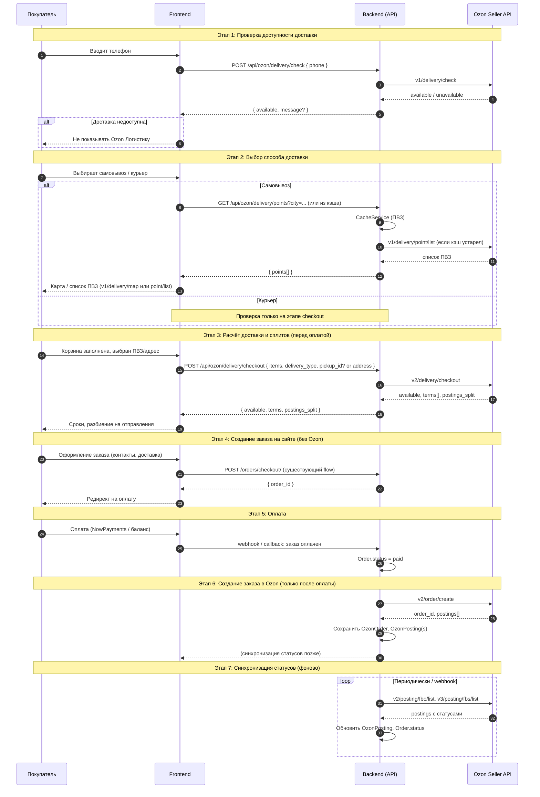

# Интеграция Ozon Seller API (Ozon Logistics)

Документ описывает архитектуру интеграции Ozon в web-приложение: sequence-diagram оформления заказа, структуру БД под Ozon-заказы и API-контракты между backend и frontend.

---

## 1. Sequence-diagram: оформление заказа (шаг за шагом)



Кратко по этапам:

| Этап | Действие | Ozon API |
|------|----------|----------|
| 1 | Проверка доставки по телефону | `v1/delivery/check` |
| 2 | Список/карта ПВЗ | `v1/delivery/point/list`, `v1/delivery/map` (кэш) |
| 3 | Расчёт сроков и сплитов | `v2/delivery/checkout` |
| 4 | Оформление на сайте | — (ваш checkout) |
| 5 | Оплата | — (NowPayments / баланс) |
| 6 | Создание заказа в Ozon | `v2/order/create` |
| 7 | Статусы FBO/FBS | `v2/posting/fbo/*`, `v3/posting/fbs/*` |

---

## 2. Структура БД под Ozon-заказы

Связь с существующей моделью `orders.Order`: заказ на сайте один, в Ozon может быть один заказ и несколько постингов (отправлений).

### 2.1 Модели Django (рекомендуемая структура)

```python
# orders/models.py (дополнения) или отдельное приложение ozon/

# --- OAuth ---
class OzonToken(models.Model):
    """Токены OAuth (Client ID / Secret в .env; access/refresh — в БД или кэше)."""
    # Если хранить только один аккаунт: без unique. Иначе — связь с "подключением продавца".
    access_token = models.TextField(blank=True)
    refresh_token = models.TextField(blank=True)
    expires_at = models.DateTimeField(null=True, blank=True)
    updated_at = models.DateTimeField(auto_now=True)


# --- Кэш ПВЗ (опционально, можно кэшировать в Redis) ---
class OzonPickupPointCache(models.Model):
    """Кэш ПВЗ Ozon для быстрой выдачи без запроса к API."""
    ozon_id = models.CharField(max_length=64, unique=True, db_index=True)  # id точки в Ozon
    name = models.CharField(max_length=255, blank=True)
    address = models.TextField(blank=True)
    city_name = models.CharField(max_length=200, blank=True)
    latitude = models.DecimalField(max_digits=9, decimal_places=6, null=True, blank=True)
    longitude = models.DecimalField(max_digits=9, decimal_places=6, null=True, blank=True)
    raw_data = models.JSONField(default=dict, blank=True)  # ответ API для отладки
    updated_at = models.DateTimeField(auto_now=True)


# --- Заказ в Ozon (1:1 с Order при доставке через Ozon) ---
class OzonOrder(models.Model):
    """Заказ в Ozon, привязанный к заказу на сайте."""
    order = models.OneToOneField(
        'orders.Order',
        on_delete=models.CASCADE,
        related_name='ozon_order',
        verbose_name='Заказ на сайте',
    )
    ozon_order_id = models.CharField('ID заказа в Ozon', max_length=64, db_index=True)
    delivery_type = models.CharField(
        max_length=20,
        choices=[
            ('pickup', 'ПВЗ'),
            ('courier', 'Курьер'),
        ],
    )
    ozon_pickup_point_id = models.CharField(
        'ID ПВЗ в Ozon',
        max_length=64,
        blank=True,
        db_index=True,
    )
    raw_request = models.JSONField(default=dict, blank=True)
    raw_response = models.JSONField(default=dict, blank=True)
    created_at = models.DateTimeField(auto_now_add=True)
    updated_at = models.DateTimeField(auto_now=True)

    class Meta:
        verbose_name = 'Заказ Ozon'
        verbose_name_plural = 'Заказы Ozon'


# --- Постинги (отправления) FBO / FBS ---
class OzonPosting(models.Model):
    """Одно отправление (постинг) в Ozon — часть заказа."""
    ozon_order = models.ForeignKey(
        OzonOrder,
        on_delete=models.CASCADE,
        related_name='postings',
        verbose_name='Заказ Ozon',
    )
    posting_id = models.CharField('ID постинга в Ozon', max_length=64, db_index=True)
    posting_type = models.CharField(
        max_length=10,
        choices=[
            ('fbo', 'FBO'),
            ('fbs', 'FBS'),
        ],
    )
    status = models.CharField(
        'Статус в Ozon',
        max_length=64,
        blank=True,
        db_index=True,
    )
    status_updated_at = models.DateTimeField(null=True, blank=True)
    raw_data = models.JSONField(default=dict, blank=True)
    created_at = models.DateTimeField(auto_now_add=True)
    updated_at = models.DateTimeField(auto_now=True)

    class Meta:
        verbose_name = 'Постинг Ozon'
        verbose_name_plural = 'Постинги Ozon'
        unique_together = [['ozon_order', 'posting_id']]
```

### 2.2 Связь с существующими моделями

- `Order` — без изменений или добавить флаг `delivery_provider` (например `'own' | 'ozon'`), чтобы отличать заказы с доставкой Ozon от своих ПВЗ.
- `Order.delivery_type` уже есть: `courier` / `pickup` — для Ozon те же значения.
- `Order.pickup_point` — ваша точка (`catalog.PickupPoint`). Для Ozon можно хранить только `OzonOrder.ozon_pickup_point_id` и при отображении подтягивать название из кэша `OzonPickupPointCache` или не связывать с `PickupPoint`, если ПВЗ только из Ozon.

### 2.3 Отмена и возвраты

- Для отмены: хранить в `OzonOrder` или в логе достаточно данных, чтобы вызывать `v1/order/cancel` или `v1/posting/cancel`.
- Возвраты: список из `v1/returns/list` можно не дублировать в БД, а отображать по API; при необходимости — таблица `OzonReturn` с `return_id`, `posting_id`, `status`, `raw_data`.

---

## 3. API-контракты Backend ↔ Frontend

Все эндпоинты ниже — ваш backend; фронт дергает только их. Ozon дергает только backend.

### 3.1 Проверка доступности доставки (по телефону)

**Запрос**

```http
POST /api/ozon/delivery/check
Content-Type: application/json

{
  "phone": "+79991234567"
}
```

**Ответ (доставка доступна)**

```json
{
  "available": true
}
```

**Ответ (доставка недоступна)**

```json
{
  "available": false,
  "message": "Доставка Ozon в ваш регион недоступна"
}
```

**Ошибка (4xx/5xx)**

```json
{
  "error": "ozon_api_error",
  "detail": "Текст ошибки"
}
```

---

### 3.2 Список ПВЗ (для самовывоза)

Имеет смысл отдавать из кэша (CacheService). При необходимости можно передать регион/город.

**Запрос**

```http
GET /api/ozon/delivery/points?city_name=Москва
```

**Ответ**

```json
{
  "points": [
    {
      "id": "12345",
      "name": "ПВЗ Ozon, ул. Примерная, 1",
      "address": "ул. Примерная, 1",
      "city_name": "Москва",
      "latitude": 55.751244,
      "longitude": 37.618423
    }
  ]
}
```

---

### 3.3 Расчёт доставки и сплитов (checkout)

Вызывается перед оплатой: корзина + способ доставки + ПВЗ или адрес.

**Запрос**

```http
POST /api/ozon/delivery/checkout
Content-Type: application/json

{
  "items": [
    { "product_id": 1, "quantity": 2 },
    { "product_id": 2, "quantity": 1 }
  ],
  "delivery_type": "pickup",
  "pickup_point_id": "12345"
}
```

или для курьера:

```json
{
  "items": [
    { "product_id": 1, "quantity": 2 }
  ],
  "delivery_type": "courier",
  "address": {
    "city": "Москва",
    "street": "ул. Примерная",
    "house": "1",
    "flat": "2",
    "latitude": 55.75,
    "longitude": 37.61
  }
}
```

**Ответ**

```json
{
  "available": true,
  "terms": [
    {
      "delivery_date_min": "2025-02-05",
      "delivery_date_max": "2025-02-07",
      "delivery_type": "pickup"
    }
  ],
  "postings_split": [
    {
      "posting_id": null,
      "type": "fbo",
      "product_ids": [1, 2]
    },
    {
      "posting_id": null,
      "type": "fbs",
      "product_ids": [2]
    }
  ]
}
```

Если `available: false` — не показывать Ozon как вариант доставки для этой корзины/адреса.

---

### 3.4 Оформление заказа на сайте (существующий flow)

Без изменений контракта: фронт по-прежнему отправляет форму на `POST /orders/checkout/` с полями заказа (телефон, имя, доставка, ПВЗ или адрес и т.д.). Backend создаёт `Order` и `OrderItem`. Если выбран Ozon — после оплаты backend вызовет `v2/order/create` и создаст `OzonOrder` и `OzonPosting`.

Дополнительно можно передавать в форме:

- `delivery_provider`: `"ozon"` | `"own"` (если на одном сайте и своя доставка, и Ozon).
- Для Ozon pickup: `ozon_pickup_point_id` (строка из списка ПВЗ).

---

### 3.5 Статусы заказа (для ЛК и трекинга)

Чтобы показывать пользователю статус отправлений Ozon, backend может отдавать их в детали заказа.

**Запрос**

```http
GET /api/orders/{order_id}/
```

**Ответ (фрагмент, если есть Ozon)**

```json
{
  "id": 42,
  "status": "shipping",
  "ozon": {
    "ozon_order_id": "12345678",
    "postings": [
      {
        "posting_id": "abc-123",
        "type": "fbo",
        "status": "delivered"
      },
      {
        "posting_id": "def-456",
        "type": "fbs",
        "status": "in_delivery"
      }
    ]
  }
}
```

Синхронизация статусов: бэкенд по расписанию или webhook обновляет `OzonPosting.status` из `v2/posting/fbo/list` и `v3/posting/fbs/list`, и при необходимости маппит в `Order.status` (например «В доставке», «Выполнен»).

---

## 4. Чек-лист запуска (напоминание)

- [ ] Приложение в ЛК Ozon создано (частное), Client ID и Client Secret сохранены.
- [ ] Scopes выданы: Seller-api.ozon-logistics, posting-fbo, posting-fbs, returns, report, product.
- [ ] OAuth на backend работает (получение/обновление токенов).
- [ ] Цепочка: корзина → проверка доставки → выбор ПВЗ/адрес → checkout → заказ на сайте → оплата → создание заказа в Ozon.
- [ ] Статусы FBO/FBS синхронизируются в БД и отображаются в ЛК.
- [ ] Отмена: проверка `v1/order/cancel/check`, отмена заказа/постинга обработана.
- [ ] Кэш ПВЗ включён, TTL настроен.
- [ ] Логи и алерты на ошибки Ozon API.

---

## 5. Что можно сделать дальше

- Вынести модели Ozon в отдельное приложение `ozon` и подключить в `INSTALLED_APPS`.
- Реализовать сервисы: `AuthService`, `DeliveryService`, `CheckoutService`, `OrderService`, `PostingService`, `CacheService` по структуре из спецификации.
- Добавить фоновую задачу (Celery/cron) для синхронизации статусов постингов и кэша ПВЗ.
- Описать контракты отмены и возвратов (backend ↔ frontend), если нужен UI для отмены/возврата через Ozon.
