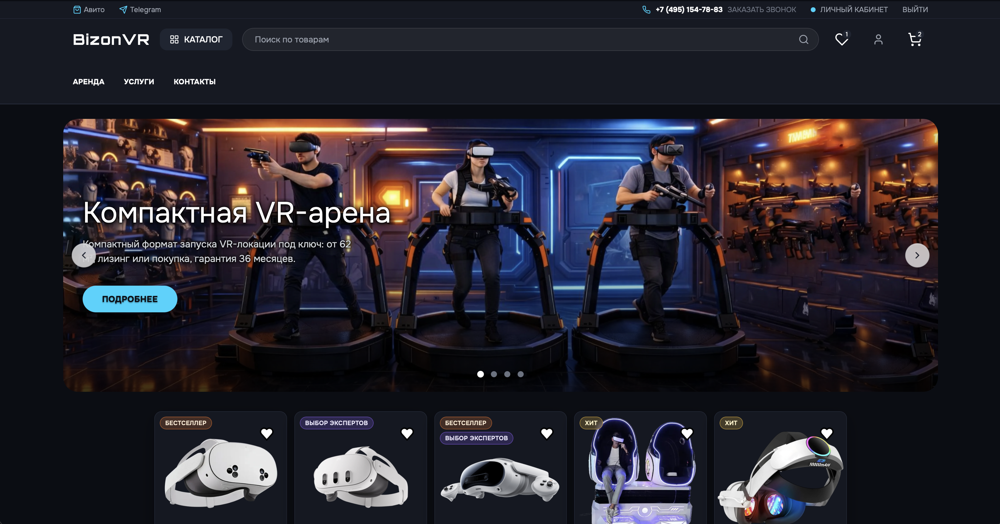
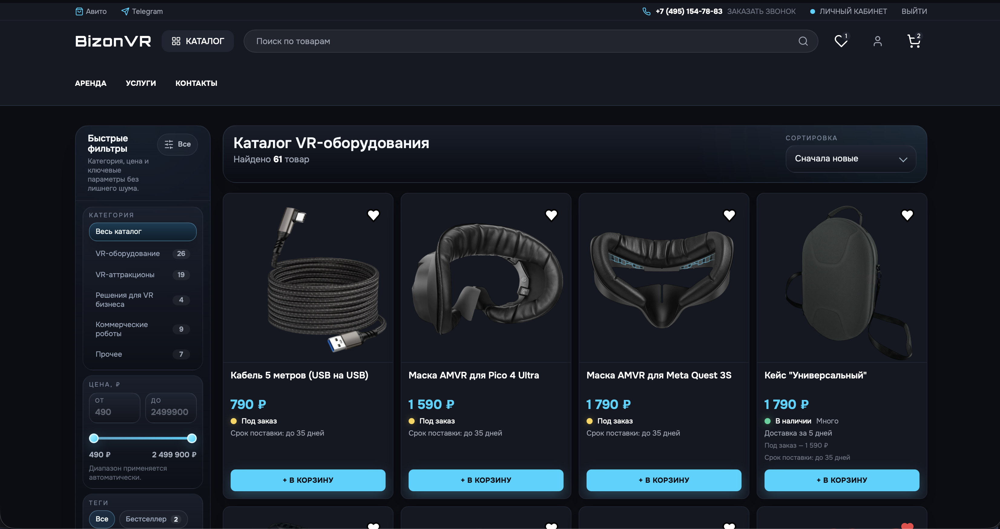
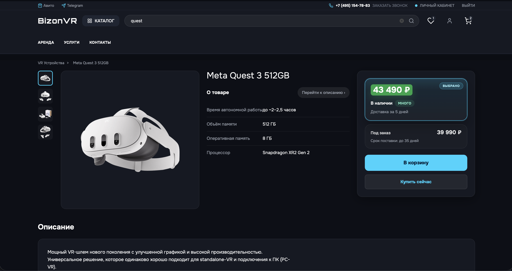
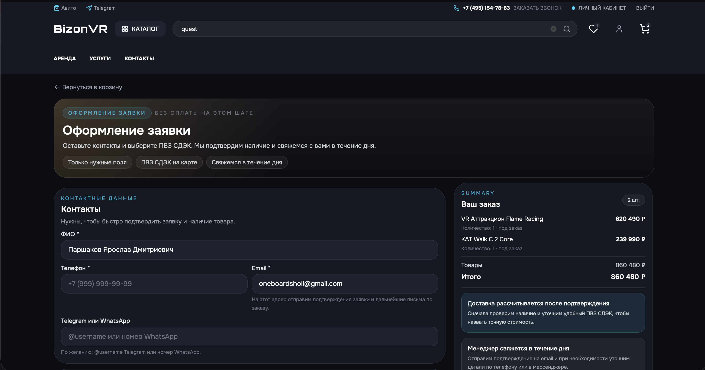
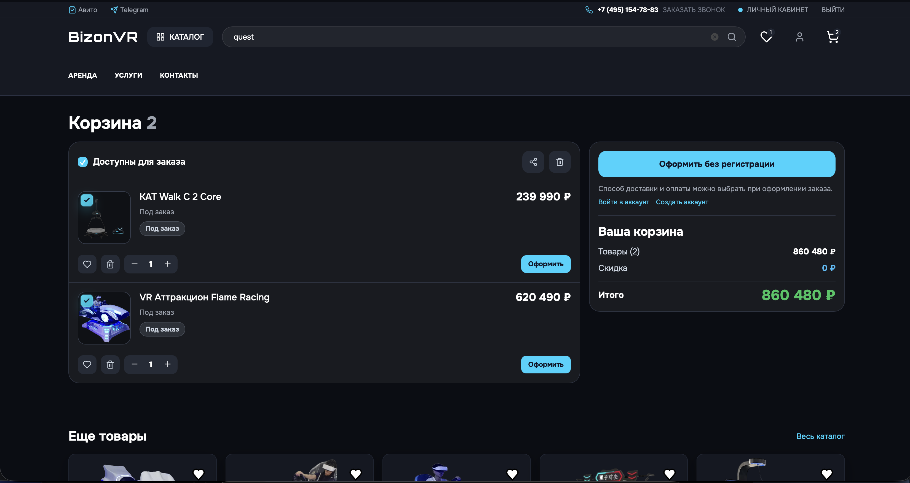
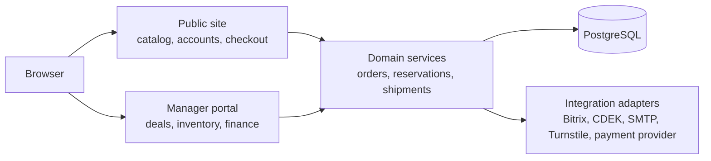

# BizonVR

[](https://github.com/yarrobong/BizonVR/actions/workflows/ci.yml)
[](https://www.python.org/)
[](https://www.djangoproject.com/)
[](https://www.postgresql.org/)

Production-oriented Django commerce and operations platform built around real BizonVR workflows for VR equipment, accessories, services, inventory, orders, and manager-led fulfillment.

It combines a public storefront with an internal operations surface in one transactional application: customers can browse and place orders, while managers can work with deals, stock, reservations, shipments, payments, documents, and external integrations.

> **Portfolio focus:** backend development, business-process automation, integrations, transactional workflows, testing, and production-minded engineering.

## At a glance

| Area | What is implemented |
| --- | --- |
| Public commerce | Catalog, product variants, carts, guest checkout, accounts, order history, lead forms |
| Manager operations | Clients, deals, warehouses, reservations, procurement, shipments, finance, documents |
| Integrations | Bitrix, CDEK, SMTP, Cloudflare Turnstile, signed payment webhook |
| Data & consistency | PostgreSQL, transactions, row locking, inventory movements, reservation and shipment safeguards |
| Quality | 778 automated tests, PostgreSQL-backed CI, frontend asset checks, production configuration checks |

## Screenshots

### Main page



### Storefront catalog



### Product detail



### Checkout



### Cart



## My role

I developed and evolved this repository as part of my work around BizonVR's web and operational tooling.

My work in this codebase spans:

- Django backend and domain logic;
- public storefront and customer flows;
- manager-facing operational workflows;
- inventory, reservation, shipment, and order processing;
- external-service integrations and failure handling;
- authentication and security hardening;
- PostgreSQL-backed tests and CI;
- deployment and technical documentation.

The project is presented here as a portfolio case around solving real commerce and internal-operations problems, not as a generic demo shop.

## What it does

BizonVR is a modular Django monolith for selling and operating around VR equipment, accessories, bundles, game packs, attractions, and related services.

The public side covers:

- product and category browsing;
- product variants and characteristics;
- guest and authenticated carts;
- guest checkout without forced registration;
- customer accounts, email verification, and password recovery;
- order history and guest-order claiming;
- contact, service, product-request, and VR-club lead flows.

The manager side covers:

- client and deal management;
- warehouses and inventory;
- incoming cargo and procurement;
- stock reservations and lot allocation;
- shipment workflows;
- payment and finance state;
- documents and operational follow-up.

## Engineering highlights

- PostgreSQL is the single active persistent database for both public commerce and manager operations.
- Critical payment, order, reservation, shipment, and balance updates use `transaction.atomic()` and targeted `select_for_update()` locking.
- Reservation creation checks available stock, allocates order lines, records inventory movements, and synchronizes public stock.
- Strict reservation failures roll back the whole transaction instead of leaving partial inventory state.
- Shipment dispatch is guarded against duplicate inventory consumption and validates reservation and shippable quantities.
- Payment webhooks verify HMAC signatures, validate allowed status transitions, and reject duplicate or regressive updates.
- Guest orders use expiring access tokens; verified email can later claim matching guest orders.
- Authentication and redirect flows validate local destinations, while account-code endpoints apply IP, email, phone, and session rate limits.
- Bitrix, CDEK, SMTP, Turnstile, and payment failures are isolated at integration boundaries and covered by regression tests.
- Production configuration checks require explicit secrets, HTTPS-aware settings, email configuration, and valid deployment prerequisites.

## Architecture



The system is intentionally a modular monolith rather than a microservice architecture. Public commerce and manager operations share one transactional boundary, which keeps order, stock, reservation, payment, and shipment state consistent without distributed transactions.

See [docs/ARCHITECTURE.md](docs/ARCHITECTURE.md) for the detailed request, checkout, inventory, concurrency, integration, and deployment flows.

## Core capabilities

### Commerce

- products, variants, categories, characteristics, bundles, and game packs;
- variant-aware cart line items;
- guest checkout and authenticated checkout;
- customer profiles and order history;
- lead capture across public-site flows.

### Inventory and fulfillment

- warehouses and stock balances;
- incoming cargo;
- reservations and lot allocation;
- inventory movements;
- shipment lifecycle;
- public stock synchronization.

### Manager operations

- clients and deals;
- procurement and reservations;
- shipment workflows;
- finance and payment-state handling;
- document workflows.

### Integrations

- Bitrix;
- CDEK delivery selection;
- SMTP email;
- Cloudflare Turnstile;
- signed payment webhook.

## Tech stack

| Area | Technology |
| --- | --- |
| Backend | Python 3.12+, Django 6.0.1 |
| Database | PostgreSQL, one active `default` database |
| Frontend | Django templates, Tailwind CSS, JavaScript |
| Authentication | Django auth, email verification, password reset |
| Integrations | SMTP, Bitrix, CDEK API, Cloudflare Turnstile, signed payment webhook |
| Runtime | Gunicorn, WhiteNoise, Nginx deployment configuration |
| Testing | Django test suite with PostgreSQL-backed settings |
| CI | GitHub Actions, PostgreSQL 17, Node.js 22 |
| Optional runtime support | Redis cache backend through `CACHE_REDIS_URL` |

## Testing and CI

The current suite contains **778 automated tests** covering:

- Django system and production configuration checks;
- PostgreSQL-backed application behavior;
- checkout, guest access, authentication, email verification, and security regressions;
- inventory, reservation, shipment, and concurrency-sensitive workflows;
- payment webhook signature, duplicate, and regression behavior;
- external integration failure isolation;
- isolated temporary `MEDIA_ROOT` behavior during test runs.

The CI workflow has three jobs:

1. **Backend (PostgreSQL)** — installs Python dependencies, runs Django checks, validates migration drift and the single-database contract, then runs the full Django test suite.
2. **Frontend assets** — runs `npm ci`, builds Tailwind CSS, and audits production npm dependencies.
3. **Production configuration** — runs `check --deploy` and `collectstatic` with production-like settings.

## Security and consistency notes

The application treats checkout, payment, reservation, and shipment changes as consistency-sensitive workflows.

Key safeguards include:

- database transactions around multi-step state changes;
- targeted PostgreSQL row locking for concurrency-sensitive paths;
- duplicate and regressive payment-webhook protection;
- HMAC webhook verification;
- local redirect validation;
- throttling for sensitive account-code endpoints;
- failure isolation around external services;
- explicit production-secret and deployment validation.

This repository is not presented as independently security-certified; these are code-level controls implemented and tested in the project.

## Project status

The repository is portfolio-ready and actively maintained.

Verified in the current project baseline:

- core commerce workflows;
- manager workflows in the same Django application;
- PostgreSQL-backed automated test suite with 778 tests;
- automated CI for backend, frontend assets, and production configuration;
- local development and deployment documentation.

Public demo hosting is not currently available.

## Quick start

```bash
git clone https://github.com/yarrobong/BizonVR.git
cd BizonVR
createdb bizon
cp .env.example .env
make install-local
make migrate-local
make superuser-local
make run-local
```

Open the public site at `http://127.0.0.1:8000/` and Django admin at `http://127.0.0.1:8000/admin/`.

To load catalog data locally:

```bash
make load-data-local
```

See [docs/LOCAL_DEVELOPMENT.md](docs/LOCAL_DEVELOPMENT.md) for the complete setup, environment contract, Windows equivalents, and validation commands.

## Project structure

The active runtime is the Django application. The repository also contains deployment, data-loading, frontend asset, documentation, and archived migration/import support files.

`legacy/` contains archived import sources and is not a separate deployment target. Database migrations are part of the application's history and must be preserved.

## Documentation

- [Architecture](docs/ARCHITECTURE.md) — system boundaries and transactional flows.
- [Local development](docs/LOCAL_DEVELOPMENT.md) — setup and validation.
- [Manager portal](docs/MANAGER_PORTAL.md) — operations, logistics, finance, and document workflows.
- [Order and account flow](docs/ORDER_PLACEMENT_AND_ACCOUNT_FLOW.md) — guest checkout and account behavior.
- [Admin guide](docs/ADMIN_GUIDE.md) — catalog and public-site administration.
- [VR club games admin](docs/VR_CLUB_GAMES_ADMIN.md) — game and pack authoring.
- [Deployment](DEPLOY.md) — Gunicorn, Nginx, HTTPS, and PostgreSQL deployment.
- [Deployment updates](DEPLOY_UPDATE.md) — repeat deployment procedure.
- [Portfolio screenshot plan](docs/screenshots/portfolio/README.md) — capture routes and redaction requirements.

## Repository boundaries

- The active runtime is the Django application.
- `legacy/` contains archived import sources only.
- PostgreSQL is the active persistent database contract.
- The manager portal is an internal surface documented here for inspection.
- Public-site documentation changes do not alter manager runtime behavior.
