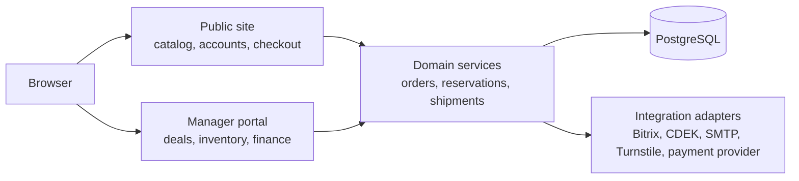

# BizonVR

Production-oriented Django e-commerce platform for VR equipment, accessories,
services, inventory operations, and manager-led payment workflows.

[](https://github.com/yarrobong/BizonVR/actions/workflows/ci.yml)
[](https://www.python.org/)
[](https://www.djangoproject.com/)
[](https://www.postgresql.org/)

## Overview

BizonVR is a monolithic Django commerce platform for selling VR headsets,
accessories, bundles, game packs, attractions, and related services. It serves
both individual customers and the team that validates, fulfills, and follows up
their orders.

The public site covers catalog browsing, guest and authenticated carts, guest
checkout, customer accounts, order history, and lead forms. A manager portal in
the same Django application handles deals, clients, warehouses, reservations,
shipments, finance, and documents.

## Highlights

- Catalog with products, variants, categories, characteristics, bundles, and game packs.
- Guest and authenticated carts with variant-aware line items.
- Guest checkout that creates an order request without requiring registration.
- Customer accounts with email verification, password login, profile data, and order history.
- Order lifecycle with manager confirmation, payment state, delivery state, and email events.
- Inventory across warehouses, incoming cargo, reservations, lot allocations, and public stock sync.
- Manager operations for clients, deals, procurement, reservations, shipments, finance, and documents.
- Lead capture from checkout, product requests, contacts, service pages, and VR club flows.
- Optional integrations for Bitrix, CDEK delivery selection, Cloudflare Turnstile, SMTP, and a signed payment webhook.

## Engineering Highlights

- PostgreSQL is the only active persistent database, keeping public commerce and manager operations in one transactional boundary.
- Critical payment, order, reservation, shipment, and balance updates use `transaction.atomic()` and targeted `select_for_update()` row locks.
- Reservation creation checks available stock, allocates order lines, records inventory movements, and synchronizes public stock.
- Strict reservation failures raise inside the transaction, so partial reservation writes roll back together.
- Shipment dispatch is guarded against duplicate inventory consumption and validates reservation and shippable quantities.
- Payment webhooks verify HMAC signatures, validate status transitions, and prevent duplicate or regressive state changes.
- Guest orders use expiring access tokens; verified email can later claim matching guest orders.
- Login and redirect flows validate local destinations, while account code endpoints apply IP, email, phone, and session rate limits.
- External Bitrix, CDEK, SMTP, Turnstile, and payment failures are handled at integration boundaries and covered by regression tests.
- Production configuration checks require explicit secrets, HTTPS-aware settings, email configuration, and valid deployment prerequisites.

## Architecture



This is a modular monolith, not a microservice system. See the detailed
[architecture document](docs/ARCHITECTURE.md) for request, checkout, inventory,
payment, concurrency, and deployment flows.

## Screenshots

A curated screenshot set is being prepared from the local demo environment.
See the [portfolio screenshot plan](docs/screenshots/portfolio/README.md)
for the selected flows and capture requirements.

## Tech Stack

| Area | Technology |
| --- | --- |
| Backend | Python 3.12+, Django 6.0.1 |
| Database | PostgreSQL, one active `default` database |
| Frontend | Django templates, Tailwind CSS, JavaScript |
| Authentication | Django auth, email verification, password reset |
| Integrations | SMTP, Bitrix, CDEK API, Cloudflare Turnstile, signed payment webhook |
| Runtime | Gunicorn, WhiteNoise, Nginx deployment configuration |
| Testing | Django test suite with PostgreSQL-backed settings |
| CI | GitHub Actions, PostgreSQL 17, Node.js 22 |
| Optional runtime support | Redis cache backend through `CACHE_REDIS_URL` |

## Testing & Quality

The current suite contains **778 automated tests**. The tests cover:

- Django checks and production configuration validation;
- PostgreSQL-backed application behavior;
- checkout, guest access, authentication, email verification, and security regressions;
- inventory, reservation, shipment, and concurrency-sensitive workflows;
- payment webhook signature, duplicate, and regression behavior;
- external integration failure isolation;
- isolated temporary `MEDIA_ROOT` for test runs.

The CI workflow has three jobs:

1. `Backend (PostgreSQL)`: installs Python dependencies, runs `check`, migration drift validation, the single-database contract, and the full Django suite.
2. `Frontend assets`: runs `npm ci`, builds Tailwind CSS, and audits production npm dependencies.
3. `Production configuration`: runs `check --deploy` and `collectstatic` with production-like settings.

## Project Status

Portfolio-ready and actively maintained.

- Core commerce workflow implemented.
- Manager workflow implemented in the same Django application.
- PostgreSQL-backed test suite with 778 passing tests.
- Automated CI with backend, frontend asset, and production configuration checks.
- Local development and production deployment documentation available.

Public demo is not currently hosted.

## Quick Start

```bash
git clone https://github.com/yarrobong/BizonVR.git
cd BizonVR
createdb bizon
cp .env.example .env
make install-local
make migrate-local
make superuser-local
make run-local
```

Open the public site at `http://127.0.0.1:8000/` and Django admin at
`http://127.0.0.1:8000/admin/`. To load catalog data locally, run:

```bash
make load-data-local
```

See [docs/LOCAL_DEVELOPMENT.md](docs/LOCAL_DEVELOPMENT.md) for the complete
local setup, environment contract, Windows equivalents, and validation commands.

## Documentation

- [Architecture](docs/ARCHITECTURE.md), system boundaries and transactional flows.
- [Local development](docs/LOCAL_DEVELOPMENT.md), setup and validation.
- [Manager portal](docs/MANAGER_PORTAL.md), operational, logistics, finance, and document workflows.
- [Order and account flow](docs/ORDER_PLACEMENT_AND_ACCOUNT_FLOW.md), guest checkout and account behavior.
- [Admin guide](docs/ADMIN_GUIDE.md), catalog and public-site administration.
- [VR club games admin](docs/VR_CLUB_GAMES_ADMIN.md), game and pack authoring.
- [Deployment](DEPLOY.md), Gunicorn, Nginx, HTTPS, and PostgreSQL deployment.
- [Deployment updates](DEPLOY_UPDATE.md), repeat deployment procedure.
- [Portfolio screenshot plan](docs/screenshots/portfolio/README.md), real capture routes and redaction requirements.

## Repository Boundaries

The active runtime is the Django application. `legacy/` contains archived import
sources and is not a separate deployment target. Database migrations are part of
the application history and must be preserved.

The manager portal is an internal surface and is documented here for inspection;
public-site documentation work does not change its runtime code.
