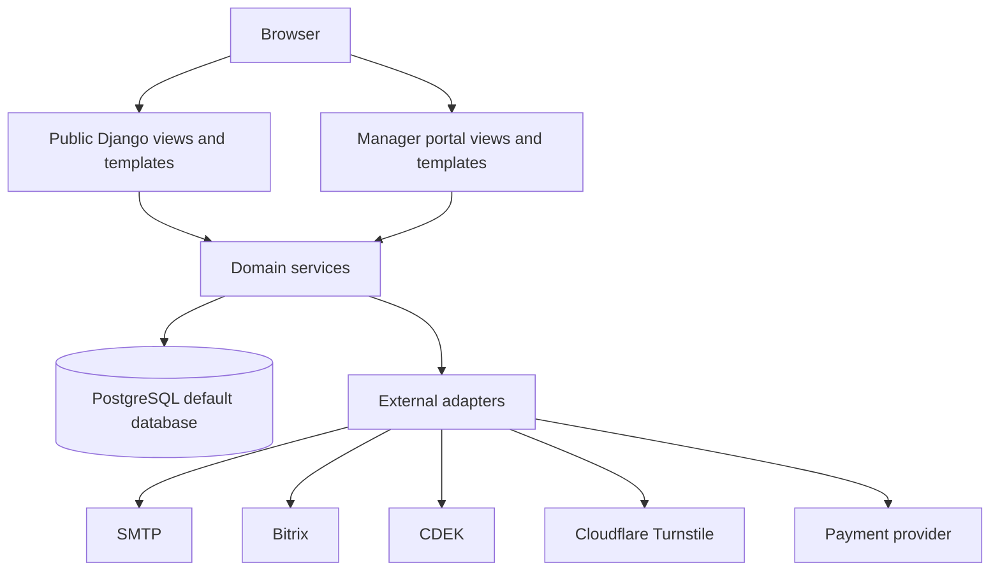
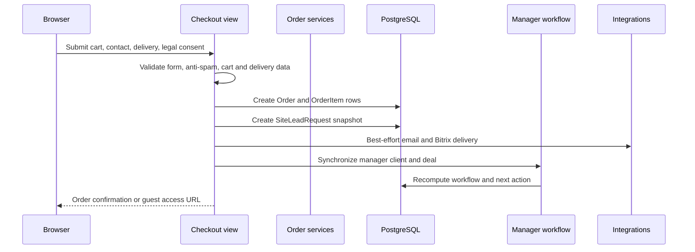
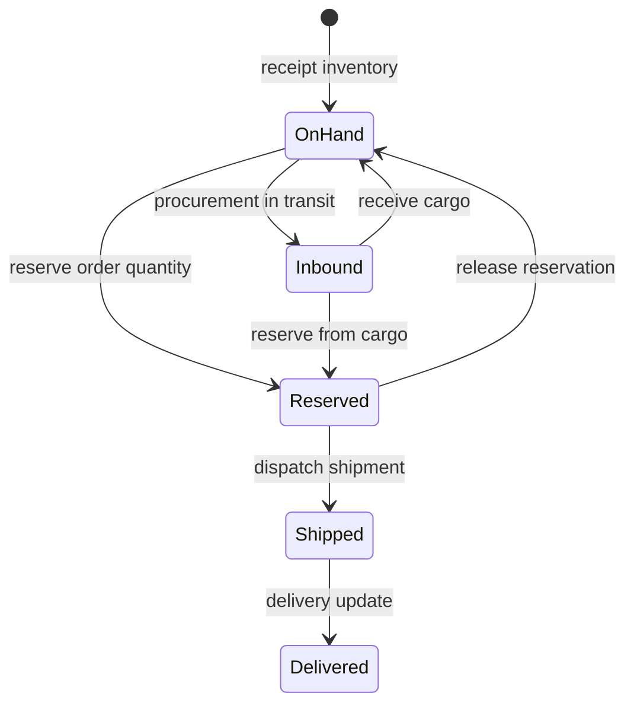
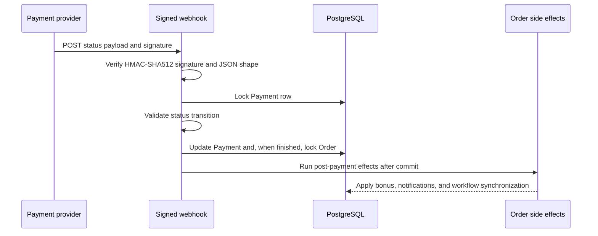

# Architecture

## System Overview

BizonVR is a modular monolith built on Django. The public storefront and the
internal manager portal run in one application and use one PostgreSQL database.
The codebase separates request handling, domain services, persistence models,
templates, and integration adapters without introducing independent services.

## Application Boundaries

| Boundary | Responsibility | Main locations |
| --- | --- | --- |
| Public site | Catalog, product pages, carts, checkout, accounts, lead forms | `config/`, `catalog/`, `accounts/`, `orders/` |
| Manager portal | Deals, clients, inventory, procurement, reservations, shipments, finance, documents | `manager_portal/` |
| Operations UI | Operational views that support the manager workflow | `operations/` |
| Warehouse UI | Warehouse-specific views and transfer helpers | `warehouse_ui/` |
| Payments | Payment model, provider client, checkout redirects, signed webhook | `payments/` |
| Integrations | Site leads, Bitrix synchronization, external form boundaries | `integrations/` |
| Persistence | Django models and migrations backed by PostgreSQL | `*/models.py`, `*/migrations/` |

`legacy/` is an archive of import sources. It is not an active runtime and does
not justify a second Django database alias. Import commands load legacy data into
the active PostgreSQL database.

## Request Flow

1. Django URL configuration routes a browser request to a public or manager view.
2. The view validates authentication, permissions, CSRF, forms, and request-specific input.
3. The view calls a domain service when the operation changes order, inventory, payment, or manager state.
4. The service performs the database work inside an appropriate transaction boundary.
5. The response renders a Django template or returns JSON/HTMX-compatible content.
6. Integration adapters are called at explicit boundaries and record failures without exposing credentials or raw secrets.

The frontend is server-rendered Django HTML with Tailwind CSS and small JavaScript
enhancements. Some endpoints return partial HTML or JSON for
interactive UI updates without introducing a separate frontend application.

## Checkout Flow

The public checkout is an order-request flow. It does not require an account and
does not create a `Payment` record as part of the normal manager-contact checkout.

The order stores a snapshot of customer, delivery, legal-consent, and line-item
data so later manager work is not dependent on mutable cart state. A guest order
receives an expiring token. A verified email can later claim matching guest
orders, after which the order is available in the account area.

## Inventory & Reservation Flow

Public stock is derived from warehouse-side inventory and synchronized to catalog
stock for warehouses linked to a public pickup point.

The main entities are:

- `InventoryLot`, physical warehouse lots;
- `InventoryBalance`, an aggregate cache by warehouse, product, and variant;
- `Reservation` and `ReservationItem`, active promises of stock from warehouse or incoming cargo;
- `InventoryMovement`, the audit trail for receipt, reserve, release, and related movements;
- `Shipment` and `ShipmentItem`, the fulfillment record;
- `ProductStock`, the public catalog stock synchronized from eligible warehouses.

`ensure_order_reservations()` selects available inventory, creates reservation
items, records reserve movements, and updates public stock. Strict failures raise
inside the atomic operation, which prevents a partially-created reservation.
Custom order lines remain visible in the deal but do not enter the catalog supply
contour.

`dispatch_shipment()` validates that the shipment is non-empty, checks open
reservation and shippable quantities, locks the shipment row, releases reserved
allocations, records shipped allocations, and prevents a second inventory
consumption using `inventory_consumed_at`.

## Payment Flow

The public checkout normally creates an unpaid order request. A manager confirms
the order and coordinates payment using the manager workflow. The payment module
also contains a configured provider client and a signed webhook path for payment
records.

The webhook rejects invalid signatures, unknown payments, invalid statuses, and
regressive transitions. A finished payment is not allowed to overwrite an
already-refunded order. Post-payment side effects are isolated from the payment
state write, so a manager workflow or email failure does not roll back a valid
payment update.

## Data Integrity & Concurrency

- `DATABASES["default"]` is the only active database configuration.
- `transaction.atomic()` groups reservation, shipment, payment, stock, and balance writes where partial state would be unsafe.
- `select_for_update()` locks the rows whose current state controls a concurrent decision, including payment, order, shipment, and account balance rows.
- Inventory availability is recalculated from physical, reserved, fulfilled, released, and incoming quantities rather than trusted from a stale form.
- Reservation movement writes and lot allocation updates are coupled to the reservation operation.
- Idempotency flags and state-transition checks protect repeated shipment and payment callbacks.
- PostgreSQL-backed regression tests exercise transactional behavior and duplicate-event paths.

## External Integrations

| Integration | Boundary behavior |
| --- | --- |
| Bitrix | Site lead requests can create or update contacts and deals; sync errors are captured and do not prevent the core request from being stored. |
| CDEK | The checkout widget uses a server-side proxy for configured delivery-point, city, and tariff requests; unavailable configuration returns a controlled error. |
| SMTP | Account and order event email is sent through Django email settings; delivery failures are logged and do not corrupt order state. |
| Cloudflare Turnstile | Public form verification is optional by configuration and can reject suspicious submissions. |
| Payment provider | Provider requests use a configured API key; callbacks require a configured HMAC secret and a valid status transition. |
| Redis | Optional Django cache backend selected through `CACHE_REDIS_URL`; local tests use an in-memory cache. |

## Security

- CSRF protection and POST-only mutation endpoints are part of the web boundary.
- Guest order pages and payment redirects require the order's expiring access token when no authenticated owner is present.
- Redirect targets are constrained to local safe destinations.
- Email verification, registration, login, and recovery endpoints use cooldowns and rate limits by relevant IP, identifier, and session keys.
- Production settings reject the insecure default secret key when `DEBUG=False` and validate deployment prerequisites through `check --deploy`.
- Logs and test output redact database passwords and should use placeholders for all credentials in documentation.

## Testing Strategy

The suite contains 778 tests across config, catalog, accounts, orders, payments,
manager portal, operations, and warehouse UI. It uses the PostgreSQL test
database, temporary media storage, in-memory email, and mocked upstream services
for deterministic integration failures.

Regression coverage is concentrated around guest access, email authentication,
checkout, inventory locking, reservation rollback, shipment idempotency, payment
webhooks, external failure isolation, production checks, and the single-database
contract.

## Deployment

The documented deployment target is one Django process group behind Nginx,
served by Gunicorn and backed by PostgreSQL. WhiteNoise serves collected static
assets. Deployment checks cover migrations, the single-database contract,
`check --deploy`, `collectstatic`, HTTPS-aware settings, SMTP configuration, and
database backup before migration.

See [DEPLOY.md](../DEPLOY.md) for first deployment and
[DEPLOY_UPDATE.md](../DEPLOY_UPDATE.md) for repeat deployment.

## Known Trade-offs

- The system is intentionally a modular monolith, which keeps checkout and manager inventory operations close to one database transaction but couples their deployment lifecycle.
- Public checkout is manager-led rather than an instant online payment flow, matching the current business process.
- Redis and upstream integrations are optional configuration paths, so local development can run without those services.
- Some manager-side projections are derived read models and must be rebuilt or synchronized from their source entities.
- The repository contains legacy import sources for continuity, but those sources are not part of the active runtime.
