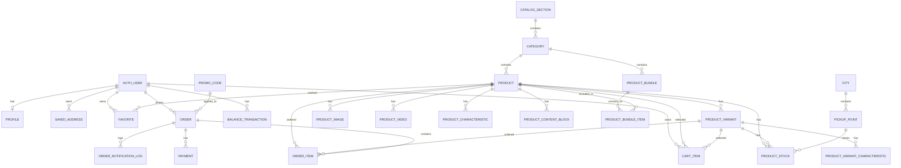
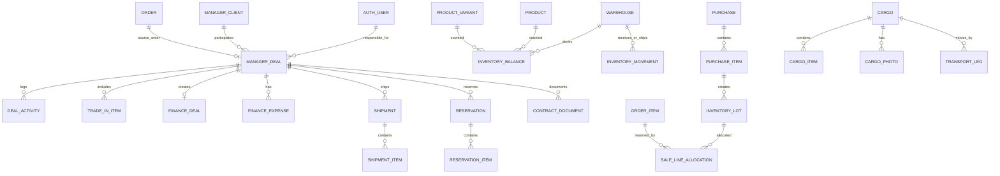

# Глава 1. Аналитическая часть

## 1.1. Общая характеристика проекта

BizonVR - это веб-приложение интернет-магазина VR-оборудования, аксессуаров, комплектов и VR-аттракционов. Проект объединяет публичную витрину, каталог товаров, корзину, оформление заказа, личный кабинет покупателя, платежный контур, административную панель и внутренний менеджерский портал.

Система ориентирована на продажу технически сложных товаров, где для клиента важны не только цена и фотография, но и наличие по городам, варианты комплектации, консультация менеджера, доставка, юридически корректное оформление заказа и возможность сопровождения сделки после отправки заявки.

Проект реализован как серверное веб-приложение на Django 6 с PostgreSQL в качестве единственной основной базы данных. Пользовательский интерфейс построен на Django Templates и Tailwind CSS. Для интерактивных сценариев используются небольшие JavaScript-вставки, HTMX, AJAX/JSON-запросы и серверная генерация HTML-фрагментов.

Ключевая особенность проекта заключается в том, что это не только каталог товаров, но и операционный e-commerce контур. Помимо публичных страниц, в проекте есть инструменты для менеджеров: обработка заказов, работа с логистикой, резервами, закупками, финансами, договорами и импортом legacy-данных.

## 1.2. Актуальность разработки

Рынок VR-оборудования отличается от классической розничной торговли несколькими особенностями:

- товары часто имеют сложные технические характеристики;
- один и тот же товар может иметь варианты, комплектации, состояние, разные цены из наличия и под заказ;
- покупатель может быть как частным лицом, так и представителем бизнеса;
- для B2B-покупателей важны документы, счета, договоры и консультации;
- наличие товара зависит от точки выдачи, города, склада или статуса поставки;
- часть покупок требует общения с менеджером до окончательной оплаты;
- пользователю нужно доверять продавцу, поскольку VR-оборудование дорогостоящее и технически специфичное.

Типовые маркетплейсы решают задачу массовой продажи, но слабо подходят для сопровождения технически сложной B2B/B2C-сделки. Простые сайты-каталоги и лендинги позволяют показать товары, но часто не имеют полноценной корзины, истории заказов, статусов, менеджерского workflow и учета остатков.

Поэтому актуальна разработка специализированного веб-приложения, которое соединяет возможности интернет-магазина, CRM-подобного менеджерского контура и административной панели.

## 1.3. Цель проекта

Цель проекта - разработать веб-приложение для продажи VR-оборудования и VR-аттракционов, которое обеспечивает полный цикл пользовательского и внутреннего бизнес-процесса: от просмотра каталога до оформления заказа, оплаты, сопровождения менеджером и дальнейшего обслуживания клиента.

Система должна решать следующие основные проблемы:

- разрозненность данных о товарах, остатках, заказах и клиентах;
- отсутствие удобного единого каталога VR-оборудования и VR-аттракционов;
- необходимость оформлять заказы как для гостей, так и для зарегистрированных пользователей;
- сложность учета вариантов товаров, комплектов, изображений, видео и характеристик;
- необходимость фиксировать юридические согласия пользователя;
- необходимость поддерживать разные сценарии оплаты и коммуникации с менеджером;
- необходимость предоставлять сотрудникам внутренний инструмент для обработки заказов и сделок.

## 1.4. Задачи проекта

Для достижения цели необходимо решить следующие задачи:

| N | Задача | Содержание задачи |
|---|---|---|
| 1 | Разработка каталога | Реализовать разделы, категории, товары, варианты, изображения, видео, характеристики, теги, комплекты и услуги. |
| 2 | Реализация поиска и фильтрации | Предусмотреть поиск по товарам, live-search подсказки, фильтры, сортировку и пагинацию. |
| 3 | Реализация корзины | Поддержать корзину для гостя через сессию и для авторизованного пользователя через базу данных. |
| 4 | Реализация избранного | Дать пользователю возможность сохранять товары в избранное в гостевом и авторизованном режимах. |
| 5 | Оформление заказа | Реализовать checkout с контактами, доставкой, получателем, промокодом, юридическими согласиями и проверкой остатков. |
| 6 | Платежный контур | Поддержать создание платежных сущностей, страницу ожидания оплаты и webhook-обработку статусов. |
| 7 | Личный кабинет | Реализовать профиль, настройки, сохраненные адреса, историю заказов и баланс пользователя. |
| 8 | Авторизация и регистрация | Поддержать регистрацию, вход, подтверждение email, восстановление доступа и служебные коды подтверждения. |
| 9 | Работа с файлами | Обеспечить загрузку и отображение изображений товаров, категорий, контентных блоков, медиа и документов. |
| 10 | Администрирование | Настроить Django Admin для управления каталогом, заказами, оплатами, профилями и заявками. |
| 11 | Manager Portal | Реализовать внутренний интерфейс для менеджеров: сделки, резервы, логистика, финансы, договоры, импорт данных. |
| 12 | Безопасность | Использовать CSRF-защиту, rate limiting, проверку прав доступа, safe redirect, защищенные токены гостевых заказов. |
| 13 | Производительность | Использовать PostgreSQL, оптимизированные ORM-запросы, кеширование live-search, пагинацию, минифицированный CSS. |
| 14 | Развертывание | Подготовить проект к production-запуску через Gunicorn, systemd, Nginx, WhiteNoise и PostgreSQL. |
| 15 | Тестирование | Проверить ключевые сценарии каталога, корзины, заказов, аккаунтов, оплат и менеджерского контура. |

## 1.5. Объект и предмет разработки

Объект разработки - процесс онлайн-продажи VR-оборудования и VR-аттракционов.

Предмет разработки - веб-приложение, которое автоматизирует публикацию каталога, сбор корзины, оформление заказа, учет пользователя, платежный сценарий и внутреннюю обработку заказов сотрудниками.

Пользовательская часть проекта отвечает за взаимодействие покупателя с магазином. Внутренняя часть отвечает за сопровождение бизнес-процесса после создания заказа.

## 1.6. Обзор аналогов

Для анализа аналогов были рассмотрены несколько типов веб-приложений:

- специализированные интернет-магазины VR-оборудования;
- сайты поставщиков VR-аттракционов;
- универсальные маркетплейсы;
- классифайды и доски объявлений;
- типовые e-commerce решения на CMS или конструкторах.

### 1.6.1. Специализированные VR-магазины

К специализированным аналогам можно отнести сайты, ориентированные на продажу VR-шлемов, аксессуаров, аттракционов и оборудования для VR-бизнеса. Такие решения обычно содержат каталог, карточки товаров, формы заявки, контактные данные и консультационный сценарий.

Примеры:

- Top-VR - интернет-магазин и поставщик VR-аттракционов;
- VRTrend - магазин VR-шлемов и аксессуаров;
- VR-Zone - каталог VR-шлемов, аттракционов и оборудования;
- Portal Play и похожие сайты поставщиков развлекательного оборудования.

Преимущества специализированных VR-магазинов:

- фокус на конкретной предметной области;
- более понятная структура для покупателя VR-оборудования;
- наличие консультационного сценария;
- возможность размещать технические описания и демонстрационные материалы;
- лучшее соответствие B2B-сценариям, чем у массовых маркетплейсов.

Недостатки специализированных VR-магазинов:

- не всегда есть полноценная корзина;
- часто заказ превращается только в заявку без прозрачной истории;
- может отсутствовать личный кабинет;
- не всегда отображается наличие по городам и точкам выдачи;
- слабая интеграция с внутренними процессами менеджеров;
- ограниченная автоматизация оплаты, резервов и документов.

### 1.6.2. Универсальные маркетплейсы

К универсальным аналогам относятся Ozon, Wildberries и другие платформы, где можно найти VR-шлемы, аксессуары и сопутствующие товары.

Преимущества маркетплейсов:

- большая аудитория;
- развитый поиск и фильтрация;
- привычный для пользователя checkout;
- встроенная доставка и оплата;
- отзывы, рейтинги и сравнение предложений;
- высокая стабильность инфраструктуры.

Недостатки маркетплейсов для ниши BizonVR:

- слабая кастомизация карточек технически сложных товаров;
- ограниченное представление B2B-комплектов и VR-аттракционов;
- сложно показать комплексные решения для VR-бизнеса;
- продавец не контролирует весь пользовательский путь;
- внутренний менеджерский процесс остается за пределами платформы;
- документы, счета и индивидуальные условия требуют внешней коммуникации.

### 1.6.3. Доски объявлений и классифайды

К этой группе относится Avito и аналогичные площадки. Они подходят для размещения отдельных товаров, б/у оборудования или быстрых объявлений.

Преимущества классифайдов:

- быстрый старт продаж;
- большая аудитория;
- простое размещение объявления;
- удобная коммуникация с покупателем;
- возможность продавать единичные позиции.

Недостатки:

- нет полноценного собственного каталога с иерархией и комплектами;
- нет управляемого checkout внутри сайта продавца;
- ограничена работа с юридическими согласиями и документами;
- нет собственной истории заказов и клиентского кабинета;
- трудно автоматизировать склад, резервы, оплату и менеджерский workflow;
- бренд продавца зависит от интерфейса внешней платформы.

### 1.6.4. Типовые сайты на CMS и конструкторах

Многие интернет-магазины строятся на CMS или конструкторах. Для простого каталога это быстрый вариант, но для проекта BizonVR типового функционала недостаточно.

Преимущества CMS/конструкторов:

- быстрый запуск;
- готовые шаблоны дизайна;
- базовая админка;
- типовые платежные и доставочные модули;
- низкий порог входа для контент-менеджера.

Недостатки:

- сложнее реализовать нестандартный manager portal;
- труднее поддерживать специфическую модель остатков по точкам выдачи;
- ограниченная гибкость сложного checkout;
- зависимость от плагинов;
- усложнение поддержки при росте кастомной логики;
- возможные ограничения производительности и безопасности.

### 1.6.5. Сравнительная таблица аналогов

| Критерий | Специализированные VR-магазины | Маркетплейсы | Классифайды | Типовые CMS-магазины | BizonVR |
|---|---|---|---|---|---|
| Каталог VR-товаров | Да | Да, но в общей структуре | Частично | Да | Да |
| VR-аттракционы и B2B-решения | Да | Ограниченно | Частично | Требует настройки | Да |
| Товарные комплекты | Частично | Ограниченно | Нет | Частично | Да |
| Остатки по городам и точкам | Часто ограниченно | Платформенно | Нет | Требует доработки | Да |
| Гостевая корзина | Не всегда | Да | Нет | Да | Да |
| Корзина пользователя | Не всегда | Да | Нет | Да | Да |
| Избранное | Частично | Да | Частично | Частично | Да |
| Checkout с юр. согласиями | Частично | Платформенно | Нет | Требует настройки | Да |
| Личный кабинет | Частично | Да | Платформенный | Да | Да |
| Менеджерский портал | Обычно нет | Нет для продавца | Нет | Требует разработки | Да |
| Документы и договоры | Часто вручную | Вне платформы | Вне платформы | Требует доработки | Да |
| Оплата и webhook | Частично | Да | Платформенно | Через плагины | Да |
| Гибкость бизнес-логики | Средняя | Низкая для продавца | Низкая | Средняя | Высокая |
| Контроль над брендом и UX | Высокий | Низкий | Низкий | Средний | Высокий |

### 1.6.6. Вывод по обзору аналогов

Анализ показывает, что ни один тип аналога полностью не закрывает потребности проекта. Маркетплейсы сильны в массовой продаже и логистике, но плохо подходят для индивидуального B2B-сопровождения и собственного менеджерского процесса. Классифайды помогают привлекать клиентов, но не являются полноценной e-commerce системой. Специализированные VR-магазины ближе к предметной области, но часто ограничиваются каталогом и заявками.

BizonVR целесообразно развивать как собственное веб-приложение, поскольку проекту нужна гибкая доменная модель: товары, варианты, комплекты, остатки, города, точки выдачи, корзина, заказы, оплаты, юридические согласия и manager portal в едином контуре.

## 1.7. Требования к приложению

Требования к приложению делятся на функциональные и нефункциональные.

Функциональные требования описывают, что система должна делать.

Нефункциональные требования описывают, как система должна работать: безопасно, быстро, удобно, надежно и сопровождаемо.

## 1.8. Функциональные требования

### 1.8.1. Управление каталогом

Система должна поддерживать CRUD-операции для основных сущностей каталога:

| Сущность | Назначение | Основные операции |
|---|---|---|
| `CatalogSection` | Разделы каталога верхнего уровня | Создание, редактирование, сортировка, удаление |
| `Category` | Категории товаров | Создание, редактирование, привязка к разделу, загрузка изображения |
| `Product` | Основная карточка товара | Создание, редактирование, публикация, снятие с публикации |
| `ProductVariant` | Варианты товара | Создание вариантов по модели, цвету, комплектации или SKU |
| `ProductImage` | Дополнительные изображения | Загрузка, сортировка, удаление |
| `ProductVideo` | Видео товара | Добавление RUTUBE-ссылки, получение embed-данных |
| `ProductCharacteristic` | Характеристики товара | Создание и редактирование параметров |
| `ProductContentBlock` | Контентные блоки карточки | Текст, изображение, видео, порядок отображения |
| `ProductBundle` | Комплекты товаров | Создание набора, расчет состава и цены |
| `ProductTag` | Маркеры товара | Новинка, акция, бестселлер и другие теги |
| `Service` | Услуги и сервисные предложения | Создание и редактирование услуг |

CRUD реализуется преимущественно через Django Admin и внутренние интерфейсы. Для части бизнес-сущностей дополнительные операции доступны в manager portal.

### 1.8.2. Публичный каталог

Публичный каталог должен предоставлять пользователю следующие возможности:

- просмотр списка товаров;
- просмотр разделов и категорий;
- открытие карточки товара по slug;
- отображение цены из наличия и цены под заказ;
- отображение вариантов товара;
- отображение изображений, видео и контентных блоков;
- отображение характеристик;
- отображение статуса наличия;
- просмотр комплектов товаров;
- переход к связанным товарам и рекомендациям;
- открытие лендингов и страниц услуг.

В проекте это реализовано через приложение `catalog`, маршруты `/catalog/`, `/catalog/product/<slug>/`, `/catalog/bundle/<slug>/` и шаблоны в `templates/catalog/`.

### 1.8.3. Поиск, фильтрация, сортировка и пагинация

Приложение должно поддерживать удобную навигацию по каталогу:

- поиск по названию и описанию товара;
- live-search подсказки через JSON endpoint `/catalog/search/suggest/`;
- фильтрацию по категориям, характеристикам, тегам и другим параметрам;
- сортировку по популярности, цене, новизне или релевантности;
- пагинацию для длинных списков;
- сохранение параметров фильтрации в URL;
- частичное обновление интерфейса через HTMX, когда это уместно.

Наличие этих функций важно, потому что каталог VR-оборудования может содержать разные группы товаров: шлемы, аксессуары, кабели, станции, аттракционы, комплекты и решения для бизнеса.

### 1.8.4. Корзина

Корзина должна работать в двух режимах:

| Режим | Где хранится состояние | Назначение |
|---|---|---|
| Гость | Django session | Пользователь может собрать корзину без регистрации |
| Авторизованный пользователь | База данных, модель `CartItem` | Корзина сохраняется между сессиями и устройствами |

Корзина должна поддерживать:

- добавление товара;
- добавление варианта товара;
- добавление комплекта;
- изменение количества;
- удаление позиции;
- очистку корзины;
- расчет суммы;
- отображение товаров под заказ;
- проверку доступного остатка;
- переход к оформлению заказа;
- шаринг корзины через `CartShare`.

Для интерактивных операций используются POST-запросы, HTMX и частичный рендеринг HTML-фрагментов.

### 1.8.5. Избранное

Система должна позволять пользователю сохранять товары в избранное.

Требования к избранному:

- гость может добавлять товары в избранное в рамках сессии;
- авторизованный пользователь хранит избранное в базе данных;
- кнопка избранного должна работать без полной перезагрузки страницы;
- список избранного должен быть доступен по отдельному маршруту;
- состояние избранного должно корректно отображаться в каталоге и карточке товара.

### 1.8.6. Оформление заказа

Checkout должен обеспечивать создание заказа из корзины. Основная сущность заказа - `Order`, состав заказа хранится в `OrderItem`.

Форма оформления заказа должна собирать:

- имя покупателя;
- фамилию при необходимости;
- телефон;
- email;
- город;
- адрес;
- способ доставки;
- получателя;
- телефон получателя;
- комментарий;
- промокод;
- предпочтительный канал связи;
- юридические согласия.

При создании заказа система должна:

- проверить состав корзины;
- пересчитать суммы на сервере;
- проверить остатки;
- определить позиции из наличия и под заказ;
- применить промокод, если он валиден;
- сохранить снимок товара и цены на момент заказа;
- очистить корзину после успешного оформления;
- создать гостевой токен доступа, если пользователь не авторизован;
- отправить сервисные уведомления, если они настроены.

### 1.8.7. Заказы и история заказов

Система должна поддерживать жизненный цикл заказа.

Основные статусы:

- новый;
- подтвержден;
- в доставке;
- готов к выдаче;
- выполнен;
- отменен.

Для пользователя должны быть доступны:

- страница созданного заказа;
- история заказов в личном кабинете;
- детальная страница заказа;
- защищенный доступ к гостевому заказу по токену;
- отображение статуса оплаты;
- отображение состава заказа и итоговой суммы.

Для менеджера должны быть доступны:

- просмотр заказов;
- изменение статусов;
- обработка оплаты;
- сопровождение доставки;
- работа с резервами и документами через manager portal.

### 1.8.8. Оплата

В проекте предусмотрен платежный модуль `payments`.

Система должна поддерживать:

- создание платежа для заказа;
- хранение внешнего идентификатора платежного провайдера;
- хранение суммы и валюты;
- хранение ссылки или реквизитов оплаты;
- отображение страницы ожидания оплаты;
- обработку webhook от платежного провайдера;
- перевод платежа в финальный статус;
- изменение статуса заказа после успешной оплаты;
- запуск дополнительных бизнес-действий после оплаты.

Бизнес-требования проекта предусматривают оплату по СБП, банковской карте или через менеджера для юридических лиц. При этом текущая кодовая база сохраняет менеджерский сценарий согласования оплаты, legacy-платежные настройки и webhook-контур, что позволяет поддерживать переходные сценарии интеграции и постепенно расширять публичные способы оплаты.

### 1.8.9. Регистрация, авторизация и личный кабинет

Система должна поддерживать учетные записи пользователей.

Функции аккаунта:

- регистрация пользователя;
- вход пользователя;
- выход из аккаунта;
- подтверждение email;
- восстановление доступа;
- профиль пользователя;
- контактное лицо;
- телефон;
- сохраненные адреса;
- история заказов;
- баланс;
- настройки уведомлений.

Текущее состояние проекта:

- публичный экран входа использует email + пароль;
- регистрация требует email, пароль, контактное лицо и согласие на обработку персональных данных;
- подтверждение email выполняется кодом из письма;
- в моделях также присутствуют сущности SMS-кодов и телефонной верификации;
- гостевые заказы могут быть привязаны к аккаунту после подтверждения email.

### 1.8.10. Работа с файлами и изображениями

Приложение должно поддерживать загрузку и отображение файлов:

- изображения категорий;
- основные изображения товаров;
- изображения вариантов;
- дополнительные фотографии товара;
- изображения контентных блоков;
- изображения комплектов;
- медиа для лендингов;
- документы и файлы manager portal, если они требуются бизнес-процессом.

Для обработки изображений используется `ImageField` и библиотека Pillow. Файлы хранятся в `media/`, а статические ресурсы проекта - в `static/`. Сгенерированные файлы `staticfiles/` являются результатом `collectstatic` и не считаются исходным кодом.

### 1.8.11. AJAX-запросы и динамический интерфейс

Для повышения удобства интерфейса приложение должно использовать AJAX-подход там, где не требуется полноценная SPA-архитектура.

В проекте используются:

- `JsonResponse` для live-search и сервисных endpoint'ов;
- HTMX для добавления в корзину, обновления фрагментов и manager portal drawer;
- `fetch()` для отдельных клиентских сценариев;
- POST-запросы для изменения корзины и избранного;
- JSON webhook для платежей;
- CDEK service endpoint для интеграции доставки.

Преимущество выбранного подхода состоит в том, что основная страница остается серверно отрендеренной, но отдельные действия выполняются без полной перезагрузки.

### 1.8.12. REST API и обмен данными

В рамках текущей архитектуры проект не является API-first приложением и не использует Django REST Framework как основной слой. Основной интерфейс - серверные HTML-страницы.

При этом в системе присутствуют REST-like и JSON endpoint'ы:

- `/catalog/search/suggest/` - JSON-подсказки поиска;
- `/orders/cdek-widget/service/` - сервисный endpoint для CDEK;
- `/payments/webhook/` - прием webhook от платежного провайдера;
- endpoint'ы manager portal для внутренних JSON-ответов;
- YML/XML-подобный feed `/feeds/vr-attractions.yml`.

Для дальнейшего развития может быть выделен полноценный REST API. Он может включать:

| Ресурс | Возможные методы | Назначение |
|---|---|---|
| `/api/products/` | GET | Получение списка товаров |
| `/api/products/<id>/` | GET | Получение карточки товара |
| `/api/cart/` | GET, POST, PATCH, DELETE | Работа с корзиной |
| `/api/favorites/` | GET, POST, DELETE | Работа с избранным |
| `/api/orders/` | GET, POST | Создание и просмотр заказов |
| `/api/payments/` | POST, GET | Создание и проверка платежей |
| `/api/profile/` | GET, PATCH | Данные пользователя |

Для публичного REST API потребуется дополнительно определить авторизацию, rate limiting, сериализаторы, версионирование, права доступа и формат ошибок.

### 1.8.13. Административная панель

Администратор должен иметь возможность управлять ключевыми данными проекта через Django Admin:

- разделы каталога;
- категории;
- товары;
- варианты;
- изображения;
- характеристики;
- видео;
- комплекты;
- города;
- точки выдачи;
- остатки;
- корзины и избранное при необходимости диагностики;
- заказы;
- позиции заказов;
- промокоды;
- платежи;
- профили;
- коды подтверждения;
- формы обращений;
- служебный контент.

Django Admin выбран как быстрый и надежный способ создать внутреннюю административную часть без разработки отдельной панели с нуля.

### 1.8.14. Manager Portal

Помимо Django Admin, проект содержит отдельный manager portal. Он нужен не для технического администрирования, а для ежедневной операционной работы сотрудников.

Manager portal должен поддерживать:

- обработку клиентских сделок;
- просмотр и сопровождение заказов;
- контроль резервов;
- логистику и отгрузки;
- закупки;
- грузы;
- финансовые операции;
- договоры;
- коммерческие предложения;
- импорт legacy-данных;
- внутренние статусы и SLA.

Это отличает BizonVR от обычного учебного интернет-магазина: приложение решает не только публичный пользовательский сценарий, но и внутренний бизнес-процесс.

### 1.8.15. Юридические согласия

Система должна фиксировать юридически значимые согласия пользователя.

В заказах и формах должны храниться:

- факт согласия;
- дата и время согласия;
- версия юридических документов;
- IP-адрес;
- User-Agent.

Это требуется для обработки персональных данных, пользовательского соглашения, оферты, cookies и условий сервисных заявок.

### 1.8.16. Уведомления

Система должна поддерживать сервисные уведомления.

Каналы:

- email;
- SMS как инфраструктурно предусмотренный канал;
- ручная коммуникация менеджера через телефон, Telegram, WhatsApp или email.

События:

- подтверждение email;
- восстановление доступа;
- создание заказа;
- подтверждение заказа;
- получение оплаты;
- отправка заказа;
- готовность к выдаче;
- отмена заказа.

### 1.8.17. SEO и публичные страницы

Проект должен поддерживать не только каталог, но и маркетинговые страницы.

В приложении предусмотрены:

- главная страница;
- страницы аренды;
- страницы решений;
- лендинги;
- контакты;
- sitemap.xml;
- robots.txt;
- legal pages;
- feed для VR-аттракционов.

Это важно для поисковой индексации и продвижения VR-оборудования в разных сегментах спроса.

## 1.9. Нефункциональные требования

### 1.9.1. Безопасность

Система должна обеспечивать защиту пользовательских данных, заказов и административных функций.

Ключевые требования безопасности:

- использование CSRF-защиты для POST-форм;
- защита от clickjacking через стандартные middleware Django;
- безопасная обработка паролей средствами Django;
- password validators;
- хранение секретов в переменных окружения;
- настройка `ALLOWED_HOSTS`;
- настройка `CSRF_TRUSTED_ORIGINS`;
- защита от open redirect после входа;
- rate limiting для отправки и проверки email-кодов;
- поддержка Cloudflare Turnstile для публичных форм;
- проверка прав доступа для личного кабинета и manager portal;
- защищенный токен гостевого заказа;
- ограничение доступа к manager portal для сотрудников;
- использование PostgreSQL как единственной runtime-БД;
- отказ от новых persistent SQLite-баз вне legacy-контура.

Дополнительно для production требуется:

- HTTPS на уровне Nginx;
- закрытый `SECRET_KEY`;
- `DEBUG=False`;
- корректная настройка proxy headers;
- регулярное обновление зависимостей;
- резервное копирование PostgreSQL и media-файлов;
- контроль доступа к серверу и базе данных.

### 1.9.2. Производительность

Приложение должно работать быстро при росте каталога и числа заказов.

Требования производительности:

- использовать пагинацию на страницах каталога;
- применять фильтрацию на стороне базы данных;
- использовать индексы для часто запрашиваемых полей;
- использовать `select_related` и `prefetch_related` для уменьшения числа SQL-запросов;
- кешировать live-search подсказки;
- минимизировать CSS через Tailwind build;
- обслуживать static-файлы через WhiteNoise или Nginx;
- не загружать лишние изображения в карточках;
- использовать responsive image data там, где это предусмотрено;
- не превращать публичный интерфейс в тяжелую SPA без необходимости.

### 1.9.3. Надежность и целостность данных

Система должна сохранять корректность данных даже при ошибках пользователя или интеграций.

Требования:

- все заказы создаются на сервере после повторного расчета корзины;
- цены и названия товаров фиксируются в `OrderItem` как снимок на момент заказа;
- остатки проверяются при оформлении заказа;
- статусы заказа и оплаты хранятся отдельно;
- webhook должен обрабатываться контролируемо;
- модель заказа допускает гостевой сценарий без потери данных;
- миграции должны поддерживать эволюцию схемы;
- legacy-источники не должны становиться отдельным runtime;
- импорт legacy-данных должен идти через management commands.

### 1.9.4. Удобство интерфейса

Интерфейс должен быть понятным для разных типов пользователей:

- гостя, который только выбирает товар;
- покупателя, который оформляет заказ;
- зарегистрированного пользователя, который возвращается за историей и адресами;
- менеджера, который сопровождает сделку;
- администратора, который управляет данными.

Требования к UX:

- адаптивная верстка для desktop и мобильных устройств;
- понятное меню каталога;
- быстрый поиск;
- удобная карточка товара;
- заметная кнопка добавления в корзину;
- простое изменение количества в корзине;
- читаемый checkout;
- понятные ошибки валидации;
- отображение юридических согласий;
- защищенный, но не избыточно сложный вход;
- сохранение адресов для повторных заказов;
- частичное обновление страниц без лишних перезагрузок.

### 1.9.5. Кроссбраузерность

Так как проект построен на серверном HTML, CSS и умеренном JavaScript, он должен корректно работать в современных браузерах:

- Google Chrome;
- Safari;
- Mozilla Firefox;
- Microsoft Edge;
- мобильные браузеры iOS и Android.

Для этого необходимо:

- использовать стандартную HTML-разметку;
- избегать критической зависимости от экспериментальных API;
- проверять адаптивные состояния;
- обеспечивать graceful degradation для интерактивных элементов;
- не блокировать базовые пользовательские сценарии при частичных проблемах JavaScript.

### 1.9.6. Сопровождаемость

Кодовая база должна быть удобной для дальнейшего развития.

Требования:

- разделение проекта на Django-приложения по предметным областям;
- хранение бизнес-логики в `services.py`, `cart_services.py`, `stock.py` и аналогичных модулях;
- понятная структура URL и шаблонов;
- использование миграций;
- автоматизированные тесты;
- документация в `docs/`;
- единая основная база данных;
- запрет на ручное редактирование `staticfiles/`;
- возможность локального запуска через Makefile-команды.

## 1.10. Роли пользователей

В системе выделяются несколько ролей. Базовые роли соответствуют требованиям типового интернет-магазина: гость, зарегистрированный пользователь и администратор. Дополнительно в проекте есть роль менеджера, поскольку BizonVR содержит внутренний manager portal.

### 1.10.1. Гость

Гость - неавторизованный пользователь сайта.

Права и возможности гостя:

- просматривать главную страницу;
- просматривать каталог;
- искать товары;
- открывать карточки товаров;
- смотреть изображения, характеристики и видео;
- добавлять товары в корзину;
- изменять корзину в рамках сессии;
- добавлять товары в избранное в рамках сессии;
- делиться корзиной;
- оформлять заказ без регистрации;
- открывать гостевой заказ по защищенному токену;
- отправлять формы обратной связи и заявки;
- переходить на legal pages.

Ограничения гостя:

- нет постоянного личного кабинета;
- история заказов не отображается в общем списке;
- корзина и избранное зависят от сессии;
- нельзя редактировать профиль и сохраненные адреса;
- нельзя пользоваться manager portal;
- нельзя работать с административной частью.

### 1.10.2. Зарегистрированный пользователь

Зарегистрированный пользователь - покупатель, который создал аккаунт и вошел в систему.

Права и возможности:

- все возможности гостя;
- постоянная корзина в базе данных;
- постоянное избранное в базе данных;
- просмотр личного кабинета;
- редактирование профиля;
- подтверждение email;
- сохранение адресов доставки;
- выбор сохраненного адреса при заказе;
- просмотр истории заказов;
- просмотр деталей своих заказов;
- привязка гостевых заказов к аккаунту;
- просмотр баланса;
- настройка уведомлений.

Ограничения:

- доступ только к своим заказам и своим данным;
- нет доступа к заказам других пользователей;
- нет доступа к Django Admin;
- нет доступа к manager portal без staff-прав.

### 1.10.3. Менеджер

Менеджер - сотрудник магазина, который работает с операционными процессами.

Права и возможности:

- вход во внутренний manager portal;
- просмотр сделок и заказов;
- сопровождение статусов;
- работа с резервами;
- работа с логистикой;
- работа с закупками;
- работа с грузами;
- работа с финансовыми сущностями;
- подготовка договоров и коммерческих предложений;
- обработка клиентских обращений;
- использование внутренних AJAX/HTMX-инструментов manager portal.

Ограничения:

- права должны ограничиваться staff-доступом и внутренними проверками;
- менеджер не должен иметь неограниченный доступ к системным настройкам, если он не является администратором;
- опасные действия должны быть защищены подтверждениями, журналированием или правами доступа.

### 1.10.4. Администратор

Администратор - пользователь с расширенными правами, обычно `is_staff` и/или `is_superuser`.

Права и возможности:

- доступ к Django Admin;
- управление пользователями;
- управление каталогом;
- управление заказами;
- управление платежами;
- управление остатками;
- управление промокодами;
- управление заявками;
- управление служебным контентом;
- настройка справочников;
- диагностика данных;
- доступ к manager portal при наличии соответствующих прав.

Ограничения:

- действия администратора должны выполняться через защищенную админку;
- учетная запись администратора должна иметь надежный пароль;
- доступ к production-админке должен быть ограничен организационно и технически.

### 1.10.5. Матрица доступа

| Возможность | Гость | Пользователь | Менеджер | Администратор |
|---|---:|---:|---:|---:|
| Просмотр каталога | Да | Да | Да | Да |
| Поиск товаров | Да | Да | Да | Да |
| Добавление в корзину | Да | Да | Да | Да |
| Постоянная корзина | Нет | Да | Да, если действует как пользователь | Да |
| Избранное | Да, в сессии | Да, в БД | Да | Да |
| Checkout | Да | Да | Да | Да |
| Гостевой заказ по токену | Да | Да | Да, при доступе | Да |
| История своих заказов | Нет | Да | Да, по рабочим правам | Да |
| Профиль | Нет | Да | Да | Да |
| Сохраненные адреса | Нет | Да | Да | Да |
| Управление каталогом | Нет | Нет | Частично, если предусмотрено | Да |
| Управление заказами | Нет | Нет | Да | Да |
| Manager Portal | Нет | Нет | Да | Да |
| Django Admin | Нет | Нет | Обычно нет | Да |
| Изменение системных данных | Нет | Нет | Ограниченно | Да |

## 1.11. Выбор технологий

### 1.11.1. Backend-фреймворк

В исходной постановке допускается использование PHP-фреймворка, например Yii или Laravel, либо другого веб-фреймворка. Для BizonVR выбран Django 6 как "другой" фреймворк, поскольку проекту требуется сильная серверная модель, развитая ORM, встроенная административная панель, безопасность и удобная работа с формами.

Сравнение вариантов:

| Технология | Преимущества | Ограничения для BizonVR |
|---|---|---|
| Laravel | Популярный PHP-фреймворк, развитая экосистема, удобная маршрутизация | Потребовалась бы отдельная реализация админки и части внутренней бизнес-логики |
| Yii | Быстрый PHP-фреймворк, CRUD-генерация, производительность | Меньше готовых решений для современной e-commerce разработки по сравнению с Django/Laravel |
| Django | ORM, формы, шаблоны, admin, auth, security middleware, миграции | Требует Python-окружения и знания Django-экосистемы |
| FastAPI | Отличен для API-first систем | Не дает из коробки admin, template-commerce и полноценную MVC/MVT структуру |
| CMS/конструктор | Быстрый запуск | Сложно реализовать manager portal и нестандартную доменную модель |

Выбор Django обоснован следующими причинами:

- встроенная административная панель ускоряет CRUD для каталога и заказов;
- ORM подходит для сложной доменной модели;
- Django Forms упрощают валидацию checkout, профиля и регистрации;
- middleware обеспечивает базовую безопасность;
- миграции позволяют развивать структуру базы данных;
- серверные шаблоны хорошо подходят для SEO и классического интернет-магазина;
- проект может расширяться без перехода к тяжелой SPA-архитектуре.

### 1.11.2. База данных

В качестве основной базы данных используется PostgreSQL.

Причины выбора PostgreSQL:

- надежность для production-систем;
- поддержка транзакций;
- поддержка индексов;
- поддержка `JSONField`;
- удобная работа со связями;
- хорошая совместимость с Django ORM;
- возможность хранить как строгие реляционные данные, так и отдельные JSON-снимки внешних интеграций.

MySQL также мог бы использоваться для интернет-магазина, но PostgreSQL лучше соответствует требованиям проекта по целостности данных, расширяемости и сложной бизнес-модели.

Важное архитектурное ограничение проекта: активная runtime-БД должна быть только одна. Legacy-источники не подключаются как отдельные Django DB aliases и используются только для импорта в основную PostgreSQL-базу.

### 1.11.3. Frontend

Пользовательский интерфейс построен на:

- Django Templates;
- Tailwind CSS;
- HTMX;
- Alpine.js;
- небольшом JavaScript;
- Lucide Icons;
- статических и медиа-файлах.

Причины выбора:

- серверный рендеринг хорошо подходит для SEO;
- шаблоны Django упрощают работу с формами и сообщениями;
- Tailwind CSS ускоряет создание адаптивной верстки;
- HTMX позволяет обновлять отдельные блоки без написания полноценного frontend-приложения;
- Alpine.js подходит для локального состояния в интерфейсе;
- небольшой JS снижает сложность сборки и сопровождения.

SPA-фреймворк не выбран как основной, потому что проекту не требуется отделять frontend от backend. Основные сценарии - каталог, карточка, корзина, checkout, кабинет и manager portal - хорошо реализуются серверным рендерингом.

### 1.11.4. AJAX, JSON, XML/YML

Для обмена данными используются:

- JSON-ответы для live-search и внутренних endpoint'ов;
- JSON webhook для платежей;
- HTMX-запросы для частичного обновления HTML;
- YML feed для выгрузки VR-аттракционов;
- обычные HTML-формы для критичных пользовательских действий.

Такой подход позволяет не усложнять архитектуру REST API там, где достаточно серверного HTML, но сохранить возможность интеграции с внешними сервисами.

### 1.11.5. Сервер и развертывание

Production-развертывание рассчитано на:

- Linux-сервер;
- Python virtual environment;
- Gunicorn как WSGI-сервер;
- systemd для управления процессом;
- Nginx как reverse proxy;
- PostgreSQL как основную БД;
- WhiteNoise для static-файлов;
- `collectstatic` для подготовки статики;
- переменные окружения для конфигурации.

Docker может быть использован при необходимости, но текущая архитектура не требует обязательной контейнеризации. Для данного проекта достаточно классической схемы Nginx + Gunicorn + systemd + PostgreSQL.

### 1.11.6. Интеграции

В проекте предусмотрены или используются следующие интеграции:

- SMTP для email-писем;
- Exolve/SMS-инфраструктура для SMS-кодов;
- Cloudflare Turnstile для антибот-защиты;
- CDEK widget/API для доставки;
- платежный провайдер через модуль `payments`;
- RUTUBE для видео в карточках товаров;
- legacy import commands для переноса данных.

### 1.11.7. Основные зависимости

| Зависимость | Назначение |
|---|---|
| Django 6.0.1 | Основной backend-фреймворк |
| psycopg2-binary | Подключение к PostgreSQL |
| django-admin-sortable2 | Сортировка сущностей в админке |
| django-ratelimit | Ограничение частоты запросов |
| gunicorn | WSGI-сервер |
| whitenoise | Раздача static-файлов |
| pillow | Работа с изображениями |
| requests | HTTP-запросы к внешним сервисам |
| python-decouple | Конфигурация через env |
| dj-database-url | Парсинг DATABASE_URL |
| weasyprint | Генерация PDF/документов |
| redis | Инфраструктурная зависимость для кеша/очередей при необходимости |
| openpyxl | Работа с Excel-файлами |
| Tailwind CSS | Стилизация frontend |

## 1.12. Архитектурное описание проекта

Проект разделен на несколько Django-приложений:

| Приложение | Назначение |
|---|---|
| `config` | Настройки, корневые URL, главная страница, legal pages, sitemap, robots.txt |
| `catalog` | Каталог, товары, остатки, корзина, избранное, услуги, обращения |
| `orders` | Checkout, заказы, позиции заказов, промокоды, заявки |
| `payments` | Платежные сущности, создание платежа, ожидание оплаты, webhook |
| `accounts` | Пользователи, профиль, адреса, баланс, коды подтверждения |
| `manager_portal` | Внутренний портал сотрудников, сделки, резервы, логистика, финансы, договоры |
| `legacy` | Архивные источники данных для импорта, не runtime |

Логическая схема:

```text
Пользователь
   |
   v
Nginx
   |
   v
Gunicorn
   |
   v
Django BizonVR
   |
   +-- config
   +-- catalog
   +-- orders
   +-- payments
   +-- accounts
   +-- manager_portal
   |
   v
PostgreSQL
```

Схема пользовательского пути:

```text
Главная страница
   |
   v
Каталог
   |
   v
Карточка товара / комплект
   |
   v
Корзина
   |
   v
Checkout
   |
   v
Заказ
   |
   v
Оплата / согласование с менеджером
   |
   v
История заказа / личный кабинет
```

## 1.13. Основные сущности данных

### 1.13.1. Каталог

Ключевые сущности:

- `CatalogSection`;
- `Category`;
- `Product`;
- `ProductVariant`;
- `ProductTag`;
- `ProductImage`;
- `ProductVideo`;
- `ProductCharacteristic`;
- `ProductVariantCharacteristic`;
- `ProductContentBlock`;
- `ProductBundle`;
- `Service`.

Назначение этой группы сущностей - описать товарную витрину, структуру каталога и контент карточек товаров.

### 1.13.2. География и остатки

Ключевые сущности:

- `City`;
- `PickupPoint`;
- `ProductStock`.

Остатки не хранятся напрямую на товаре. Они рассчитываются через `ProductStock` по точкам выдачи, связанным с городами. Это позволяет показывать наличие в зависимости от географии.

### 1.13.3. Корзина и избранное

Ключевые сущности:

- `CartItem`;
- `CartShare`;
- `Favorite`.

Эти сущности обеспечивают пользовательские сценарии до оформления заказа.

### 1.13.4. Заказы

Ключевые сущности:

- `Order`;
- `OrderItem`;
- `PromoCode`;
- `PurchaseRequest`;
- `OrderNotificationLog`.

Заказ хранит контакты, доставку, статус, оплату, юридические согласия, промокод и гостевой токен. Позиция заказа хранит товар, вариант, количество, цену и снимок данных.

### 1.13.5. Оплаты

Ключевая сущность:

- `Payment`.

Платеж связан с заказом и хранит внешний идентификатор, сумму, валюту, статус, ссылку или реквизиты оплаты и последние webhook-данные.

### 1.13.6. Аккаунты

Ключевые сущности:

- `Profile`;
- `NotificationPreference`;
- `CommercialProposalContact`;
- `SavedAddress`;
- `BalanceTransaction`;
- `PhoneVerificationCode`;
- `EmailVerificationCode`;
- `EmailLoginCode`.

Эти сущности отвечают за профиль пользователя, контактные данные, подтверждения, адреса и баланс.

## 1.14. Вывод по аналитической части

В результате анализа предметной области, аналогов и требований можно сделать вывод, что для проекта BizonVR оправдана разработка собственного веб-приложения на фреймворке Django.

Проект требует большей гибкости, чем типовой интернет-магазин или CMS. Ему необходимы:

- специализированный каталог VR-товаров;
- поддержка вариантов, комплектов, медиа и характеристик;
- учет остатков по городам и точкам выдачи;
- корзина для гостя и пользователя;
- оформление заказа с юридическими согласиями;
- личный кабинет;
- платежный контур;
- AJAX/JSON-взаимодействия;
- административная панель;
- внутренний manager portal;
- единая PostgreSQL-база;
- возможность production-развертывания через Nginx и Gunicorn.

Выбранная архитектура соответствует задачам проекта: Django обеспечивает надежный backend, PostgreSQL - устойчивое хранение данных, Django Templates и Tailwind CSS - адаптивный интерфейс, HTMX и JSON endpoint'ы - интерактивность без чрезмерного усложнения frontend-части.

Таким образом, BizonVR является комплексной e-commerce системой для продажи VR-оборудования и сопровождения заказов, а не просто сайтом-витриной. Это определяет набор требований, роли пользователей и выбор технологического стека.

## 1.15. Информационная основа для обзора аналогов

При подготовке обзора аналогов рассматривались публичные сайты и типы решений, актуальные для рынка VR-оборудования и интернет-торговли:

- Top-VR: https://www.top-vr.ru/
- VRTrend: https://vrtrend.ru/
- VR-Zone: https://vr-zone.ru/
- Portal Play: https://portal-play.ru/catalog/
- Ozon: https://www.ozon.ru/
- Wildberries: https://www.wildberries.ru/
- Avito: https://www.avito.ru/

# Глава 2. Проектная часть

## 2.1. Общая проектная концепция

Проектная часть описывает, как требования из аналитической главы преобразованы в конкретную структуру веб-приложения BizonVR: базу данных, маршрутизацию, архитектуру приложений, контроллеры, модели, шаблоны, формы, права доступа, CRUD-операции, работу с файлами, AJAX/API и меры безопасности.

BizonVR реализован на Django, поэтому классическая схема MVC в проекте применяется в варианте Django MVT:

| Классический слой MVC | Эквивалент в Django | Реализация в BizonVR |
|---|---|---|
| Model | Model | `models.py`, миграции, Django ORM |
| View | Template | HTML-шаблоны в `templates/` |
| Controller | View + URLconf | функции и классы во `views/`, маршруты в `urls.py` |

В документации ниже термин "контроллер" используется в учебном смысле MVC и соответствует Django view: функции или классу, который принимает HTTP-запрос, обращается к моделям и сервисам, затем возвращает HTML, JSON, redirect или файл.

## 2.2. Проектирование базы данных

### 2.2.1. Общий подход к хранению данных

В проекте используется единая основная база данных PostgreSQL. Все runtime-данные сайта, личного кабинета, заказов, оплат, каталога и manager portal хранятся в `DATABASES["default"]`.

SQLite-файлы из `legacy/` не являются рабочей базой данных. Они используются только как архивные источники для импорта через management commands.

Основные группы данных:

| Группа | Назначение | Приложение |
|---|---|---|
| Каталог | Разделы, категории, товары, варианты, характеристики, медиа, комплекты | `catalog` |
| География и остатки | Города, точки выдачи, наличие товаров | `catalog` |
| Корзина и избранное | Пользовательские состояния до заказа | `catalog` |
| Заказы | Checkout, состав заказа, статусы, промокоды, заявки | `orders` |
| Оплаты | Платежные сущности, webhook-статусы | `payments` |
| Пользователи | Профиль, адреса, баланс, подтверждения | `accounts` |
| Менеджерский контур | Сделки, финансы, склад, закупки, грузы, резервы, отгрузки, договоры | `manager_portal` |
| Системные данные Django | Пользователи, группы, permissions, sessions, content types | `django.contrib.*` |

### 2.2.2. ER-диаграмма основной пользовательской части

Ниже приведена упрощенная ER-диаграмма публичного e-commerce контура. Она показывает основные сущности каталога, корзины, заказов, оплат и аккаунтов.



Примечание: `AUTH_USER` - стандартная таблица пользователя Django. В коде она подключается через `settings.AUTH_USER_MODEL`.

`CartShare` хранит состав расшаренной корзины как JSON-снимок, поэтому отдельная таблица позиций расшаренной корзины в ER-диаграмме не выделяется.

### 2.2.3. ER-диаграмма менеджерского контура

Manager portal содержит отдельный набор сущностей для внутренних процессов. Диаграмма ниже показывает основные связи без всех служебных полей.



### 2.2.4. Таблицы каталога

| Таблица / модель | Назначение | Ключевые поля | Основные связи |
|---|---|---|---|
| `CatalogSection` | Верхний раздел каталога | `name`, `slug`, `order`, `icon` | 1:N с `Category` |
| `Category` | Категория товаров | `section`, `name`, `slug`, `image`, `tile_size`, `is_bundles_category` | N:1 к `CatalogSection`, 1:N к `Product` |
| `ProductTag` | Тег товара | `name`, `slug`, `order` | M:N с `Product` |
| `Product` | Основная карточка товара | `category`, `name`, `sku`, `slug`, `description`, `price`, `discount_percent`, `price_on_request`, `image`, `is_active`, `allow_order_on_request`, marketplace URL | N:1 к `Category`, 1:N с вариантами, изображениями, видео, характеристиками, остатками |
| `ProductVariant` | Вариант товара | `product`, `name`, `sku`, `image`, `price_override`, `price_on_request_override`, `order` | N:1 к `Product` |
| `ProductImage` | Дополнительное фото | `product`, `image`, `order` | N:1 к `Product` |
| `ProductVideo` | Видео товара | `product`, `rutube_url`, `embed_url`, `thumbnail_url`, `title`, `order` | N:1 к `Product` |
| `ProductContentBlock` | Блок подробного описания | `product`, `block_type`, `title`, `text`, `image`, `rutube_url`, `sort_order`, `is_active` | N:1 к `Product` |
| `ProductCharacteristic` | Характеристика товара | `product`, `name`, `value` | N:1 к `Product` |
| `ProductVariantCharacteristic` | Характеристика варианта | `variant`, `name`, `value` | N:1 к `ProductVariant` |
| `CharacteristicDefinition` | Управляемое описание фильтра | `name`, `code`, `data_type`, `is_filterable` | Используется фильтрацией |
| `FilterConfig` | Настройки фильтров | категория, характеристика, порядок | Связь категории и фильтра |
| `ProductBundle` | Комплект товаров | `category`, `name`, `slug`, `description`, `image`, цены, скидки | 1:N к `ProductBundleItem` |
| `ProductBundleItem` | Позиция комплекта | `bundle`, `product`, `variant`, `quantity` | N:1 к `ProductBundle`, N:1 к `Product` |
| `Service` | Услуга | `title`, `description`, `price`, `is_active` | Публичные страницы услуг |

### 2.2.5. Таблицы географии и остатков

| Таблица / модель | Назначение | Ключевые поля | Основные связи |
|---|---|---|---|
| `City` | Город | `name`, `slug`, `is_active` | 1:N к `PickupPoint` |
| `PickupPoint` | Точка выдачи | `city`, `name`, `address`, `is_active` | N:1 к `City`, 1:N к `ProductStock` |
| `ProductStock` | Остаток товара | `product`, `variant`, `pickup_point`, `quantity` | N:1 к товару, варианту и точке выдачи |

Остаток не хранится в `Product` напрямую. Публичное наличие вычисляется как сумма `ProductStock` по точкам выдачи и городам. Это позволяет показывать корректное наличие для товара и варианта.

### 2.2.6. Таблицы корзины и избранного

| Таблица / модель | Назначение | Ключевые поля | Основные связи |
|---|---|---|---|
| `CartItem` | Позиция корзины пользователя | `user`, `product`, `variant`, `quantity`, `purchase_mode`, `price_override` | N:1 к пользователю, товару, варианту |
| `CartShare` | Ссылка на расшаренную корзину | `token`, `items`, `created_at`, `expires_at` | Хранит снимок корзины |
| `Favorite` | Избранный товар пользователя | `user`, `product`, `created_at` | N:1 к пользователю и товару |

Для гостя корзина и избранное хранятся в сессии. Для авторизованного пользователя состояние сохраняется в базе данных.

### 2.2.7. Таблицы заказов

| Таблица / модель | Назначение | Ключевые поля | Основные связи |
|---|---|---|---|
| `Order` | Заказ | `user`, `status`, `total`, `promo_code`, `promo_discount`, `payment_method`, `payment_status`, доставка, контакты, legal-поля, guest token | N:1 к пользователю, N:1 к промокоду, 1:N к позициям и платежам |
| `OrderItem` | Позиция заказа | `order`, `line_type`, `product`, `variant`, `product_name`, `quantity`, `price`, `condition`, себестоимость, скидки | N:1 к заказу, товару и варианту |
| `PromoCode` | Промокод | `code`, `discount_amount`, `partner_bonus`, `partner_user`, `is_active` | 1:N к заказам |
| `PurchaseRequest` | Упрощенная заявка | `phone`, `telegram`, `items`, `total`, `status`, legal-поля | Отдельный legacy/request сценарий |
| `OrderNotificationLog` | Лог уведомлений | `order`, `event`, `channel`, `created_at` | N:1 к заказу |

`OrderItem` хранит снимок названия, изображения и цены товара на момент заказа. Это нужно, чтобы история заказа оставалась корректной даже после изменения карточки товара.

### 2.2.8. Таблицы оплат

| Таблица / модель | Назначение | Ключевые поля | Основные связи |
|---|---|---|---|
| `Payment` | Платеж по заказу | `order`, `external_id`, `price_amount`, `price_currency`, `pay_amount`, `pay_currency`, `pay_address`, `pay_url`, `status`, `ipn_data` | N:1 к `Order` |

Платеж отделен от заказа, потому что у заказа и платежа разные жизненные циклы. Заказ может быть создан, подтвержден, отменен или выполнен, а платеж может ожидать оплаты, завершиться, истечь или быть возвращен.

### 2.2.9. Таблицы аккаунтов

| Таблица / модель | Назначение | Ключевые поля | Основные связи |
|---|---|---|---|
| `Profile` | Расширенный профиль | `user`, `phone`, `phone_verified_at`, `contact_name`, `email_verified_at`, `privacy_agreed_at`, `balance` | 1:1 к пользователю |
| `SavedAddress` | Сохраненный адрес | `user`, `label`, `recipient_name`, `phone`, `email`, `city`, `address`, `is_default` | N:1 к пользователю |
| `BalanceTransaction` | Операция баланса | `user`, `kind`, `amount`, `order`, `created_at` | N:1 к пользователю, N:1 к заказу |
| `NotificationPreference` | Настройки уведомлений | `user`, email/SMS flags | 1:1 к пользователю |
| `CommercialProposalContact` | Контакты для КП | `user`, `phone`, `email` | 1:1 к пользователю |
| `PhoneVerificationCode` | SMS-код | `phone`, `code`, `created_at`, `used_at` | Служебная таблица |
| `EmailVerificationCode` | Код подтверждения email | `user`, `email`, `code`, `created_at`, `used_at` | N:1 к пользователю |
| `EmailLoginCode` | Код входа/привязки заказа | `email`, `code`, `purpose`, `created_at`, `used_at` | Служебная таблица |

### 2.2.10. Таблицы manager portal

Manager portal содержит большое количество таблиц. Их удобно группировать по бизнес-процессам.

| Группа | Основные модели | Назначение |
|---|---|---|
| Клиенты и сделки | `ManagerClient`, `ManagerPersonAlias`, `ManagerDeal`, `ManagerDealParticipant`, `DealActivity`, `DealSavedView`, `TradeInItem` | Работа с клиентами, сделками, участниками и историей действий |
| Финансы | `FinanceDealType`, `FinanceDistributionScheme`, `FinanceDistributionRule`, `FinanceExpenseCategory`, `FinanceDeal`, `FinanceDealLine`, `FinanceDealShare`, `FinanceExpense`, `FinanceDealAdjustment`, `FinancePayout` | Финансовые кейсы, расходы, доли, выплаты и отчеты |
| Склад | `Warehouse`, `InventoryBalance`, `InventoryMovement`, `InventoryLot`, `SaleLineAllocation` | Остатки, партии, движения и резервирование |
| Закупки и грузы | `Purchase`, `PurchaseItem`, `Cargo`, `CargoItem`, `CargoPhoto`, `TransportLeg`, `Expense` | Закупки, поставки, транспортировка и расходы |
| Резервы и отгрузки | `Reservation`, `ReservationItem`, `Shipment`, `ShipmentItem` | Резервирование и физическая отгрузка заказов |
| Договоры | `ContractCompanyProfile`, `ContractTemplate`, `ContractDocument` | Шаблоны и документы |
| Импорт legacy | `LegacyImportBatch`, `LegacyImportRecord`, `LegacyImportConflict` | Контролируемый перенос архивных данных |

### 2.2.11. Связи между таблицами

Основные типы связей:

| Тип связи | Пример | Реализация |
|---|---|---|
| Один к одному | `User` - `Profile` | `OneToOneField` |
| Один ко многим | `Category` - `Product` | `ForeignKey` |
| Многие ко многим | `Product` - `ProductTag` | `ManyToManyField` |
| Иерархическая связь | `CatalogSection` - `Category` - `Product` | Цепочка `ForeignKey` |
| Служебная связь | `Order` - `Payment` | `ForeignKey` |
| Снимок данных | `OrderItem.product_name`, `OrderItem.product_image_url` | Денормализованные поля |
| JSON-снимок | `Order.cdek_office_snapshot`, `Payment.ipn_data` | `JSONField` |

### 2.2.12. Ограничения целостности

В проекте используются ограничения на уровне моделей и базы данных.

Примеры ограничений:

| Ограничение | Где используется | Назначение |
|---|---|---|
| `unique=True` | `slug`, коды, токены, отдельные справочники | Не допустить дубли |
| `db_index=True` | статусы, даты, внешние ID, slugs | Ускорить выборки |
| `UniqueConstraint` | адрес по умолчанию, saved views, складские остатки | Ограничить уникальность по условию или набору полей |
| `CheckConstraint` | количества, цены, cancelled/shipped qty | Не допустить отрицательные или противоречивые значения |
| `on_delete=CASCADE` | дочерние строки, изображения, позиции комплекта | Удалять зависимые записи вместе с родителем |
| `on_delete=PROTECT` | товары в заказах | Не дать удалить важные справочные данные |
| `on_delete=SET_NULL` | пользователь/менеджер/документ | Сохранить запись при удалении связанной сущности |

Примеры бизнес-ограничений:

- у пользователя может быть только один адрес по умолчанию;
- позиция заказа должна быть либо каталоговой, либо произвольной;
- отмененное количество позиции не может быть больше общего количества;
- остаток партии не может быть больше принятого количества;
- отгруженное количество не может быть больше зарезервированного;
- отдельные коды сделок, закупок, отгрузок и выплат должны быть уникальными.

### 2.2.13. Миграции фреймворка

Django использует систему миграций для управления схемой базы данных. Миграции хранятся в папках `migrations/` внутри приложений.

Основные команды:

```bash
.venv/bin/python manage.py makemigrations
.venv/bin/python manage.py migrate
.venv/bin/python manage.py showmigrations
```

В проекте миграции уже разделены по приложениям:

| Приложение | Назначение миграций |
|---|---|
| `catalog/migrations/` | Эволюция каталога, товаров, фильтров, корзины, избранного, остатков |
| `orders/migrations/` | Заказы, позиции, промокоды, доставка, legal-поля, CDEK snapshots |
| `payments/migrations/` | Таблица платежей |
| `accounts/migrations/` | Профили, адреса, баланс, подтверждения, настройки уведомлений |
| `manager_portal/migrations/` | Сделки, финансы, склад, закупки, грузы, договоры и legacy import |

Миграции позволяют:

- создавать таблицы;
- добавлять и удалять поля;
- изменять типы данных;
- добавлять индексы;
- добавлять constraints;
- выполнять data migrations;
- синхронизировать локальную и production-схему.

## 2.3. Архитектура приложения

### 2.3.1. Архитектура MVT как реализация MVC

Django формально использует паттерн MVT, но для учебного описания его можно сопоставить с MVC.

```text
HTTP-запрос
   |
   v
URLconf / routes
   |
   v
View function/class (Controller)
   |
   +--> Forms
   +--> Services
   +--> ORM Models
   |
   v
Template rendering или JsonResponse
   |
   v
HTTP-ответ
```

В BizonVR:

- `models.py` описывает структуру данных и методы предметных сущностей;
- `views/` принимает запросы, применяет формы, вызывает сервисы и возвращает ответ;
- `templates/` отвечает за HTML-представление;
- `forms.py` отвечает за ввод и валидацию;
- `services.py` и специализированные модули выносят бизнес-логику из контроллеров;
- `urls.py` связывает URL с обработчиками;
- `settings.py` содержит конфигурацию проекта.

### 2.3.2. Структура проекта

```text
BizonVR/
├── accounts/          # аккаунт, профиль, адреса, верификация, безопасность
├── catalog/           # каталог, товары, корзина, избранное, остатки, фильтры
├── config/            # настройки, корневые URL, главная, legal pages, sitemap
├── docs/              # документация проекта
├── legacy/            # архивные источники данных, не runtime
├── manager_portal/    # внутренний портал сотрудников
├── orders/            # checkout, заказы, промокоды, заявки
├── payments/          # платежи и webhook
├── deploy/            # Nginx, cloud-init и deployment-конфигурации
├── media/             # загружаемые файлы и маркетинговые медиа
├── static/            # редактируемые static-файлы
├── static_src/        # исходный Tailwind CSS
├── staticfiles/       # collectstatic output
├── templates/         # серверные Django-шаблоны
├── manage.py          # CLI Django
├── requirements.txt   # Python-зависимости
├── package.json       # frontend build dependencies
└── Makefile           # команды разработки
```

### 2.3.3. Описание директорий фреймворка

| Директория / файл | Назначение |
|---|---|
| `config/settings.py` | Основные настройки Django, БД, static/media, cache, security, integrations |
| `config/urls.py` | Корневая маршрутизация проекта |
| `config/views/` | Главная страница, контакты, legal pages, статические лендинги |
| `catalog/models.py` | Модели каталога, корзины, избранного, остатков и заявок |
| `catalog/views/` | Контроллеры каталога, корзины, избранного, поиска и feed |
| `catalog/cart_services.py` | Бизнес-логика корзины и избранного |
| `catalog/filtering.py` | Логика фильтрации каталога |
| `catalog/stock.py` | Расчет публичного статуса наличия |
| `catalog/admin/` | Расширенная админка каталога |
| `orders/models.py` | Заказы, позиции, промокоды, заявки |
| `orders/views/` | Checkout, история заказов, гостевой доступ, CDEK endpoint |
| `orders/forms.py` | Формы checkout и заявок |
| `orders/services.py` | Бонусы, списание остатков, post-payment side effects |
| `payments/models.py` | Модель платежа |
| `payments/views/` | Создание платежа, ожидание оплаты, webhook |
| `payments/services.py` | Интеграция с платежным провайдером |
| `accounts/models.py` | Профиль, адреса, баланс, коды подтверждения |
| `accounts/views/` | Вход, регистрация, профиль, восстановление доступа |
| `accounts/forms.py` | Формы логина, регистрации, профиля, адресов и подтверждений |
| `accounts/security.py` | Rate limiting и безопасность кодов |
| `manager_portal/models.py` | Внутренние бизнес-сущности |
| `manager_portal/views.py` | Контроллеры внутреннего портала |
| `manager_portal/forms.py` | Формы сделок, склада, финансов, закупок, договоров |
| `manager_portal/access.py` | Проверка доступа и декораторы ролей |
| `templates/` | HTML-шаблоны, layout, partials |
| `static/` | CSS, JS, изображения, vendor-скрипты |
| `media/` | Пользовательские и маркетинговые файлы |

### 2.3.4. Разделение ответственности

В проекте используется принцип разделения ответственности:

- URL-файлы только связывают маршрут и view;
- view отвечает за HTTP-уровень;
- forms отвечают за ввод и validation;
- services отвечают за бизнес-операции;
- models отвечают за структуру данных и простые доменные методы;
- templates отвечают за отображение;
- admin-классы отвечают за административный CRUD;
- management commands отвечают за служебные операции и импорт.

Такое разделение упрощает тестирование и развитие проекта.

## 2.4. Организация маршрутизации

### 2.4.1. Корневая маршрутизация

Корневой URLconf находится в `config/urls.py`. Он подключает приложения и отдельные публичные страницы.

| URL | Обработчик | Назначение |
|---|---|---|
| `/` | `home_view` | Главная страница |
| `/admin/` | `admin.site.urls` | Django Admin |
| `/catalog/` | `include('catalog.urls')` | Каталог, корзина, избранное |
| `/orders/` | `include('orders.urls')` | Checkout и заказы |
| `/payments/` | `include('payments.urls')` | Оплаты |
| `/accounts/` | `include('accounts.urls')` | Аккаунт и профиль |
| `/manager/` | `include('manager_portal.urls')` | Внутренний портал |
| `/contacts/` | `contacts_view` | Контакты |
| `/solutions/` | `solutions_index_view` | Страница решений |
| `/solutions/<slug>/` | `solution_landing_view` | Лендинг решения |
| `/privacy/`, `/page/*` | legal views | Юридические страницы |
| `/robots.txt` | `robots_txt_view` | Robots |
| `/sitemap.xml` | Django sitemap | Sitemap |
| `/feeds/vr-attractions.yml` | `vr_attractions_yml_feed_view` | YML-feed |

В DEBUG или при `SERVE_MEDIA=1` проект также раздает `/media/` через Django view. В production это обычно выполняет Nginx.

### 2.4.2. Маршруты каталога

| URL | View | Ответ |
|---|---|---|
| `/catalog/` | `ProductListView` | HTML-страница каталога |
| `/catalog/search/suggest/` | `product_search_suggest_view` | JSON live-search |
| `/catalog/product/<slug>/` | `ProductDetailView` | HTML-карточка товара |
| `/catalog/bundle/<slug>/` | `BundleDetailView` | HTML-карточка комплекта |
| `/catalog/cart/` | `cart_page_view` | HTML-страница корзины |
| `/catalog/cart/partial/` | `cart_partial` | HTML-фрагмент корзины |
| `/catalog/cart/add/<id>/` | `add_to_cart_view` | HTMX/redirect |
| `/catalog/cart/update/` | `cart_update_view` | HTMX/redirect |
| `/catalog/cart/clear/` | `cart_clear_view` | HTML/redirect |
| `/catalog/cart/share/create/` | `cart_share_create_view` | HTML-фрагмент share modal |
| `/catalog/cart/share/add-all/` | `cart_share_add_all_view` | HTMX |
| `/catalog/favorites/` | `favorite_list_view` | HTML-страница избранного |
| `/catalog/favorite/<id>/` | `toggle_favorite_view` | HTMX/redirect |

### 2.4.3. Маршруты заказов

| URL | View | Назначение |
|---|---|---|
| `/orders/` | `order_list_view` | История заказов авторизованного пользователя |
| `/orders/checkout/` | `checkout_view` | Оформление заказа |
| `/orders/checkout/promo/` | `checkout_promo_view` | Проверка промокода |
| `/orders/purchase-request/create/` | `purchase_request_create_view` | Создание заявки |
| `/orders/cdek-widget/service/` | `cdek_widget_service_view` | CDEK service endpoint |
| `/orders/request-created/<id>/` | `request_created_view` | Страница созданной заявки |
| `/orders/created/<id>/` | `order_created_view` | Страница после создания заказа |
| `/orders/guest/access/<token>/` | `order_guest_detail_view` | Гостевой доступ к заказу |
| `/orders/<pk>/` | `order_detail_view` | Детальная страница заказа |

### 2.4.4. Маршруты аккаунта

| URL | View | Назначение |
|---|---|---|
| `/accounts/login/` | `login_view` | Страница входа |
| `/accounts/login/password/` | `password_login_view` | POST-вход по email/паролю |
| `/accounts/register/` | `register_view` | Регистрация |
| `/accounts/register/confirm/` | `register_confirm_view` | Подтверждение email |
| `/accounts/password-reset/` | `password_reset_request_view` | Запрос восстановления |
| `/accounts/password-reset/confirm/<uidb64>/<token>/` | `password_reset_confirm_view` | Смена пароля |
| `/accounts/complete-registration/` | `complete_registration_view` | Завершение профиля |
| `/accounts/logout/` | `logout_view` | Выход |
| `/accounts/profile/` | `profile_view` | Кабинет |
| `/accounts/profile/settings/` | `profile_settings_view` | Настройки профиля |
| `/accounts/profile/balance/` | `balance_history_view` | История баланса |

### 2.4.5. Маршруты оплат

| URL | View | Назначение |
|---|---|---|
| `/payments/order/<order_id>/create/` | `create_payment_view` | Создание платежа |
| `/payments/order/<order_id>/wait/` | `payment_wait_view` | Ожидание оплаты |
| `/payments/webhook/` | `webhook_view` | Webhook платежного провайдера |

### 2.4.6. Маршруты manager portal

Manager portal подключается по префиксу `/manager/`.

Основные группы маршрутов:

| Группа | Префикс | Назначение |
|---|---|---|
| Поиск | `/manager/search/` | Глобальный поиск |
| Сделки | `/manager/deals/` | Список, создание, карточка, перемещение, действия |
| Заказы | `/manager/orders/` | Операционное управление заказами |
| Клиенты | `/manager/clients/` | Клиенты и карточки клиентов |
| Склады | `/manager/warehouses/`, `/manager/inventory/` | Остатки и движения |
| Закупки | `/manager/purchases/` | Закупки и позиции закупок |
| Грузы | `/manager/cargos/` | Грузы, фото, этапы, расходы |
| Резервы | `/manager/reservations/` | Резервирование товаров |
| Отгрузки | `/manager/shipments/` | Отправки и dispatch |
| Финансы | `/manager/finance/` | Финансовые сделки, расходы, выплаты, отчеты |
| Договоры | `/manager/contracts/` | Документы, шаблоны, настройки |
| КП | `/manager/commercial-proposals/` | Коммерческие предложения |

## 2.5. Реализация функционала

### 2.5.1. Контроллеры

Контроллеры в Django реализованы как function-based views и class-based views.

Основные задачи контроллеров:

- принять HTTP-запрос;
- проверить метод запроса;
- проверить права доступа;
- получить данные из `request.GET`, `request.POST`, `request.FILES` или body;
- создать форму и выполнить валидацию;
- обратиться к ORM и сервисам;
- сформировать контекст для шаблона;
- вернуть `render`, `redirect`, `JsonResponse`, `HttpResponse` или ошибку.

Примеры контроллеров:

| Контроллер | Файл | Назначение |
|---|---|---|
| `ProductListView` | `catalog/views/products.py` | Каталог, фильтрация, сортировка, пагинация |
| `ProductDetailView` | `catalog/views/products.py` | Карточка товара |
| `product_search_suggest_view` | `catalog/views/products.py` | JSON live-search |
| `add_to_cart_view` | `catalog/views/cart_mutations.py` | Добавление товара в корзину |
| `cart_update_view` | `catalog/views/cart_mutations.py` | Изменение количества |
| `checkout_view` | `orders/views/checkout.py` | Оформление заказа |
| `order_guest_detail_view` | `orders/views/guest.py` | Гостевой просмотр заказа |
| `webhook_view` | `payments/views/webhook.py` | Обработка webhook оплаты |
| `login_view` | `accounts/views/auth.py` | Страница входа |
| `register_view` | `accounts/views/auth.py` | Регистрация |
| `profile_settings_view` | `accounts/views/profile.py` | Настройки профиля |
| `deal_list_view` | `manager_portal/views.py` | Список сделок |
| `deal_move_view` | `manager_portal/views.py` | AJAX-перемещение сделки |
| `inventory_view` | `manager_portal/views.py` | Складской интерфейс |

### 2.5.2. Пример обработки запроса

Типовой сценарий добавления товара в корзину:

```text
Пользователь нажимает "Добавить в корзину"
   |
   v
POST /catalog/cart/add/<product_id>/
   |
   v
add_to_cart_view
   |
   +-- проверка метода POST
   +-- получение Product и variant
   +-- определение purchase_mode
   +-- обращение к cart_services
   +-- обновление session или CartItem
   |
   v
HTML-фрагмент корзины или redirect
```

Типовой сценарий checkout:

```text
GET /orders/checkout/
   |
   +-- собрать товары корзины
   +-- подготовить форму
   +-- отрендерить страницу checkout

POST /orders/checkout/
   |
   +-- провалидировать форму
   +-- перепроверить корзину и остатки
   +-- создать Order
   +-- создать OrderItem
   +-- сохранить legal acceptance
   +-- очистить корзину
   +-- отправить уведомления
   +-- redirect на страницу заказа
```

### 2.5.3. Модели и ORM

Модели Django описывают таблицы базы данных и являются основным интерфейсом работы с данными.

В проекте используются возможности Django ORM:

- `ForeignKey`;
- `OneToOneField`;
- `ManyToManyField`;
- `ImageField`;
- `JSONField`;
- `DecimalField`;
- `DateTimeField`;
- `choices`;
- `Meta.ordering`;
- `constraints`;
- `indexes`;
- `select_related`;
- `prefetch_related`;
- `annotate`;
- `Q`;
- `F`;
- `Case/When`;
- `Paginator`.

Примеры ORM-задач:

| Задача | ORM-подход |
|---|---|
| Получить активные товары | `Product.objects.filter(is_active=True)` |
| Получить товар с категорией | `select_related('category')` |
| Получить товар с вариантами и фото | `prefetch_related('variants', 'images')` |
| Посчитать остаток | `Sum('quantity')` по `ProductStock` |
| Найти товары поиска | `Q(name__icontains=query) \| Q(description__icontains=query)` |
| Защитить целостность строк заказа | `CheckConstraint` |
| Хранить CDEK snapshot | `JSONField` |

ORM защищает проект от SQL-инъекций при обычном использовании QuerySet API, потому что параметры запроса передаются отдельно от SQL-шаблона.

### 2.5.4. Сервисный слой

Часть бизнес-логики вынесена из контроллеров в отдельные модули.

| Модуль | Назначение |
|---|---|
| `catalog/cart_services.py` | Корзина, избранное, session/DB режимы |
| `catalog/stock.py` | Расчет публичного наличия |
| `catalog/pricing.py` | Цены из наличия, под заказ, скидки |
| `catalog/filtering.py` | Фильтрация каталога |
| `catalog/recommendations.py` | Рекомендации товаров |
| `catalog/image_utils.py` | Responsive image data |
| `orders/services.py` | Бонусы, списание остатков, side effects оплаты |
| `payments/services.py` | Создание платежей и интеграция провайдера |
| `accounts/services.py` | Нормализация, коды, профиль, claim guest orders |
| `accounts/security.py` | Rate limiting кодов |
| `manager_portal/services.py` | Операционная логика портала |
| `manager_portal/status_system.py` | Статусы и workflow сделок |
| `manager_portal/legacy_imports.py` | Импорт legacy-данных |

Сервисный слой нужен, чтобы контроллеры не превращались в большой набор бизнес-правил и были проще для тестирования.

## 2.6. Представления и шаблоны

### 2.6.1. Шаблонизатор

Для представлений используется встроенный шаблонизатор Django Templates.

Основной layout:

| Шаблон | Назначение |
|---|---|
| `templates/base.html` | Общая HTML-оболочка сайта |
| `templates/layout/` | Header, footer и общие partials |
| `templates/catalog/` | Каталог, карточки, корзина, избранное |
| `templates/orders/` | Checkout и страницы заказов |
| `templates/accounts/` | Вход, регистрация, профиль |
| `templates/payments/` | Страницы оплаты |
| `templates/manager_portal/` | Внутренний портал |
| `templates/admin/` | Переопределения админки |
| `templates/legal/` или legal templates | Юридические страницы |

Шаблоны получают данные через context, который формируется контроллером. Для повторяющихся блоков используются partials и template tags.

### 2.6.2. Подключение стилей и скриптов

Frontend-ресурсы организованы так:

| Ресурс | Назначение |
|---|---|
| `static_src/input.css` | Исходный Tailwind CSS |
| `static/css/tailwind.css` | Скомпилированный CSS |
| `static/` | Редактируемые статические файлы |
| `static/vendor/htmx/` | HTMX |
| `static/admin/` | Кастомизации админки |
| `media/` | Загруженные изображения и медиа |

Сборка CSS:

```bash
npm run build:css
```

Подготовка static-файлов для production:

```bash
.venv/bin/python manage.py collectstatic --noinput
```

### 2.6.3. Частичные шаблоны

Для динамических сценариев используются partial templates:

- карточки товаров;
- содержимое корзины;
- модальные окна корзины;
- состояние избранного;
- строки manager portal;
- drawer-содержимое сделок;
- фрагменты фильтров и списков.

HTMX может запрашивать серверный HTML-фрагмент и заменять только часть страницы. Это снижает сложность frontend и сохраняет преимущества серверного рендеринга.

## 2.7. Формы и валидация

### 2.7.1. Общий подход

Валидация пользовательского ввода выполняется на нескольких уровнях:

| Уровень | Механизм | Назначение |
|---|---|---|
| HTML | `required`, `type=email`, `pattern` | Первичная UX-проверка |
| Django Forms | `clean()`, `clean_<field>()`, validators | Основная серверная валидация |
| Models | `field validators`, `clean()`, choices | Доменная валидация |
| Database | constraints, unique, foreign keys | Финальная целостность данных |
| View/service | бизнес-проверки | Остатки, права, статусы, промокоды |

Главное правило: все критичные проверки выполняются на сервере. Клиентская проверка нужна только для удобства пользователя.

### 2.7.2. Формы аккаунта

Формы `accounts/forms.py`:

| Форма | Назначение |
|---|---|
| `PasswordLoginForm` | Вход по email/паролю |
| `RegistrationForm` | Регистрация пользователя |
| `RegistrationEmailConfirmForm` | Подтверждение email-кода |
| `PasswordResetRequestForm` | Запрос восстановления |
| `PasswordSetupForm` | Установка нового пароля |
| `ProfileUpdateForm` | Обновление ФИО и согласий |
| `SavedAddressForm` | CRUD сохраненных адресов |
| `NotificationPreferencesForm` | Настройки уведомлений |
| `EmailVerificationRequestForm` | Запрос email-кода |
| `EmailVerificationConfirmForm` | Проверка email-кода |
| `PhoneChangeRequestForm` | Запрос смены телефона |
| `PhoneChangeConfirmForm` | Подтверждение телефона |

### 2.7.3. Формы заказов

Формы `orders/forms.py` отвечают за checkout, промокоды, заявки и legal-согласия.

Основные проверки:

- обязательность email, телефона, имени, города и адреса;
- корректность получателя;
- обязательность legal consent;
- корректность промокода;
- доступность товара;
- допустимость количества;
- корректность delivery fields;
- корректность business fields для юридических лиц.

### 2.7.4. Формы manager portal

`manager_portal/forms.py` содержит формы для:

- сделок;
- клиентов;
- заказов;
- складов;
- приемки;
- закупок;
- грузов;
- фото грузов;
- транспортных этапов;
- расходов;
- резервов;
- отгрузок;
- договоров;
- финансовых сущностей.

Часть форм является `ModelForm`, часть - обычные `Form`, если данные не мапятся один к одному на одну модель или требуется сложная бизнес-валидация.

### 2.7.5. Защита от ошибок ввода

Используемые механизмы:

- `form.is_valid()`;
- добавление ошибок через `form.add_error()`;
- `ValidationError`;
- обязательные поля форм;
- нормализация email и телефона;
- проверка одноразовых кодов;
- проверка TTL кодов;
- проверка used status;
- проверка rate limit;
- повторный расчет суммы заказа на сервере;
- проверка прав доступа к заказу.

## 2.8. Аутентификация и авторизация

### 2.8.1. Регистрация и вход

Основной пользовательский сценарий:

```text
Регистрация
   |
   +-- email
   +-- пароль
   +-- контактное лицо
   +-- согласие на обработку ПД
   |
   v
Создание User + Profile
   |
   v
Отправка email-кода
   |
   v
Подтверждение email
   |
   v
Вход в систему
```

Вход выполняется через email + пароль. После успешного входа система:

- создает профиль при необходимости;
- создает настройки уведомлений;
- пытается привязать гостевые заказы по email;
- перенаправляет пользователя в профиль или на целевую страницу.

### 2.8.2. Восстановление доступа

Восстановление доступа выполняется через email. Пользователь получает ссылку подтверждения и затем задает новый пароль.

Защита:

- email должен существовать и быть корректным;
- токен восстановления генерируется средствами Django;
- ссылка имеет ограниченную применимость;
- ошибки формулируются так, чтобы не раскрывать лишнюю информацию.

### 2.8.3. RBAC и права доступа

В проекте используется ролевая модель на базе стандартной системы Django:

- `User`;
- `Group`;
- `Permission`;
- `is_authenticated`;
- `is_staff`;
- `is_superuser`;
- decorators;
- проверки в view.

Основные уровни доступа:

| Уровень | Механизм | Возможности |
|---|---|---|
| Гость | нет авторизации | Каталог, корзина в сессии, checkout, заявки |
| Пользователь | `request.user.is_authenticated` | Профиль, адреса, история своих заказов |
| Менеджер | `is_staff` или группы portal | Manager portal |
| Финансовый оператор | группы `manager_portal_finance_operator` / `manager_portal_finance_admin` | Финансовый раздел |
| Администратор | `is_staff`, `is_superuser`, permissions | Django Admin и системное управление |

В `manager_portal/access.py` определены декораторы:

- `staff_required`;
- `finance_required`;
- `finance_admin_required`.

### 2.8.4. Защита личных данных и заказов

Для пользовательских страниц применяются:

- `@login_required` для истории заказов и профиля;
- проверка владельца заказа;
- гостевой токен заказа с ограничением срока действия;
- safe redirect после входа;
- CSRF-токены для форм;
- rate limiting для кодов;
- проверка согласий на обработку персональных данных.

## 2.9. CRUD-операции

### 2.9.1. CRUD в Django Admin

Django Admin обеспечивает основной CRUD для справочников и административных данных:

| Сущности | Операции |
|---|---|
| Категории, разделы, товары | создание, чтение, изменение, удаление, сортировка |
| Изображения, видео, характеристики | загрузка, редактирование, удаление |
| Комплекты | создание состава, изменение цены, публикация |
| Города и точки выдачи | управление географией |
| Остатки | создание и изменение количества |
| Заказы и позиции | просмотр, изменение статусов и состава |
| Промокоды | создание, активация, деактивация |
| Платежи | просмотр статусов и webhook-данных |
| Пользователи и профили | просмотр и редактирование |
| Заявки | обработка обращений |

### 2.9.2. CRUD в публичном контуре

Публичный пользователь не управляет справочниками, но выполняет CRUD-подобные операции над своими данными:

| Сущность | Create | Read | Update | Delete |
|---|---|---|---|---|
| Корзина | Добавить товар | Просмотреть корзину | Изменить количество | Удалить / очистить |
| Избранное | Добавить товар | Просмотреть избранное | Переключить статус | Удалить из избранного |
| Заказ | Оформить заказ | Просмотреть заказ | Ограниченно, через менеджера | Отмена через менеджера |
| Профиль | Создается при регистрации | Просмотр кабинета | Редактирование данных | Обычно не удаляется пользователем |
| Адрес | Добавить адрес | Список адресов | Изменить адрес | Удалить адрес |

### 2.9.3. CRUD в manager portal

Manager portal реализует CRUD для внутренних процессов:

- создание и редактирование клиентов;
- создание сделок;
- перемещение сделок по статусам;
- создание заказов менеджером;
- создание складов;
- приемка товаров;
- создание закупок;
- добавление позиций закупки;
- создание груза;
- загрузка фото груза;
- добавление транспортных этапов;
- создание расходов;
- создание резервов;
- изменение статуса резерва;
- создание и dispatch отгрузок;
- создание договорных документов;
- управление финансовыми сделками и выплатами.

## 2.10. Работа с файлами и изображениями

### 2.10.1. Загрузка файлов

В проекте используются поля:

- `ImageField` для изображений;
- `FileField` или файловые поля manager portal, если требуется хранить документы;
- `JSONField` для снимков данных внешних сервисов;
- обычные static-файлы для дизайна и скриптов.

Примеры загрузок:

| Объект | Поле | Папка |
|---|---|---|
| Категория | `Category.image` | `media/categories/` |
| Товар | `Product.image` | `media/products/` |
| Вариант | `ProductVariant.image` | `media/products/` |
| Фото товара | `ProductImage.image` | `media/products/` |
| Контентный блок | `ProductContentBlock.image` | `media/products/content_blocks/` |
| Фото груза | `CargoPhoto` | manager portal media path |

### 2.10.2. Хранение и отображение

Настройки:

| Параметр | Значение |
|---|---|
| `MEDIA_URL` | `/media/` |
| `MEDIA_ROOT` | `BASE_DIR / 'media'` |
| `STATIC_URL` | `/static/` |
| `STATIC_ROOT` | `BASE_DIR / 'staticfiles'` |
| `STATICFILES_DIRS` | `BASE_DIR / 'static'` |

В development медиа может раздаваться Django view. В production static и media обычно раздаются через Nginx, а static также может обслуживаться WhiteNoise.

### 2.10.3. Обработка изображений

Для работы с изображениями используется Pillow.

В каталоге дополнительно применяется `catalog/image_utils.py`, который формирует responsive image data и может создавать кешированные версии изображений. Это позволяет:

- отдавать изображения подходящего размера;
- ускорять загрузку карточек;
- улучшать мобильный UX;
- не перегружать страницу оригинальными медиа.

### 2.10.4. Безопасность файлов

Требования безопасности:

- не доверять имени файла от пользователя;
- использовать стандартное хранилище Django;
- ограничивать доступ к внутренним документам;
- не хранить секреты в static/media;
- не редактировать `staticfiles/` вручную;
- проверять типы и размеры файлов на уровне форм, если файл загружается через публичный или manager-интерфейс.

## 2.11. Пагинация, фильтры и сортировка

### 2.11.1. Пагинация каталога

В каталоге используется `Paginator`. Он нужен, чтобы не загружать весь каталог одной страницей.

Пользователь получает:

- текущую страницу товаров;
- навигацию по страницам;
- сохранение GET-параметров фильтров;
- корректную работу с HTMX-частичными обновлениями.

### 2.11.2. Фильтрация каталога

Фильтрация реализована через `catalog/filtering.py` и связанные модели конфигурации фильтров.

Фильтры могут учитывать:

- категорию;
- раздел каталога;
- наличие;
- цену;
- теги;
- характеристики;
- варианты;
- режим покупки;
- поисковую строку.

Для производительности фильтрация выполняется преимущественно на уровне базы данных.

### 2.11.3. Сортировка

Возможные сценарии сортировки:

- по новизне;
- по цене;
- по популярности;
- по релевантности поиска;
- по статусу наличия;
- по порядку, заданному в админке.

В manager portal сортировка и фильтрация применяются к сделкам, заказам, финансам, складу, закупкам, грузам и резервам.

### 2.11.4. Пагинация manager portal

Внутренний портал использует `Paginator` для больших списков. Например, список сделок разбивается на страницы, а представление может переключаться между табличным и kanban-режимом.

Это важно, потому что внутренние данные растут быстрее публичного каталога: сделки, активности, расходы, отгрузки и резервы накапливаются ежедневно.

## 2.12. AJAX-запросы и API

### 2.12.1. Общий подход

BizonVR не является API-first приложением. Основной интерфейс - HTML-страницы, отрендеренные Django. Однако проект активно использует AJAX/JSON и HTMX для сценариев, где это улучшает UX.

Типы ответов:

| Тип | Использование |
|---|---|
| HTML page | Каталог, карточка, checkout, профиль |
| HTML partial | Корзина, модальные окна, manager drawer |
| JSON | Live-search, webhook, CDEK, внутренние lookup endpoint'ы |
| Redirect | Успешные формы и переходы |
| Feed | YML-выгрузка |

### 2.12.2. AJAX и HTMX в каталоге

Примеры:

- добавление товара в корзину без полной перезагрузки;
- изменение количества в корзине;
- добавление комплекта;
- переключение избранного;
- live-search через JSON;
- обновление cart modal;
- создание ссылки шаринга корзины.

### 2.12.3. JSON endpoint'ы

| Endpoint | Формат | Назначение |
|---|---|---|
| `/catalog/search/suggest/` | JSON | Подсказки поиска |
| `/orders/cdek-widget/service/` | JSON/HTTP proxy | Работа CDEK widget/service |
| `/payments/webhook/` | JSON | Прием статуса платежа |
| `/manager/clients/lookup/` | JSON | Поиск клиента |
| `/manager/commercial-proposals/search/` | JSON | Поиск для КП |
| `/manager/deals/<pk>/move/` | JSON/HTML | Перемещение сделки |
| `/feeds/vr-attractions.yml` | YML/XML-like | Выгрузка аттракционов |

### 2.12.4. REST API

Полноценный публичный REST API в проекте не выделен отдельным слоем. Это осознанное архитектурное решение: серверный rendering проще для SEO, checkout и администрирования.

При необходимости REST API может быть добавлен позже. Потенциальная структура:

| Resource | Methods | Назначение |
|---|---|---|
| `/api/products/` | GET | Список товаров |
| `/api/products/<id>/` | GET | Детали товара |
| `/api/cart/` | GET, POST, PATCH, DELETE | Корзина |
| `/api/favorites/` | GET, POST, DELETE | Избранное |
| `/api/orders/` | GET, POST | Заказы |
| `/api/payments/` | POST, GET | Платежи |
| `/api/profile/` | GET, PATCH | Профиль |

Для production REST API потребуется:

- Django REST Framework или аналогичный слой;
- сериализаторы;
- схема OpenAPI;
- token/session authentication;
- permissions;
- throttling;
- CORS-политика;
- версионирование;
- единый формат ошибок.

## 2.13. Оптимизация

### 2.13.1. Оптимизация запросов к базе данных

В проекте применяются:

- `select_related` для связей один-к-одному и многие-к-одному;
- `prefetch_related` для связей один-ко-многим и многие-ко-многим;
- `annotate` для вычисляемых значений;
- `Sum`, `Count`, `Max` для агрегаций;
- `Q` для сложных условий;
- `F` для сравнений на уровне базы данных;
- индексы на статусах, slug, датах и внешних ID;
- пагинация больших списков.

### 2.13.2. Кэширование

Используются два уровня:

| Уровень | Где используется |
|---|---|
| Django cache backend | live-search, меню каталога, категории, rate limiting |
| Request-level cache | корзина, количество товаров, избранное |

В `settings.py` предусмотрен Redis backend через `CACHE_REDIS_URL`. Если Redis не настроен, используется `LocMemCache`.

Кэшируемые данные:

- меню каталога;
- previews категорий;
- product tags;
- active category ids;
- live-search payload;
- CDEK token;
- throttling attempts;
- request-local cart/favorites state.

### 2.13.3. Оптимизация frontend

Frontend-оптимизации:

- Tailwind CSS собирается и минифицируется;
- partial updates через HTMX уменьшают объем перерисовки;
- responsive images уменьшают вес медиа;
- static-файлы в production могут получать manifest-хеши;
- WhiteNoise поддерживает compressed static storage при `DEBUG=False`;
- серверный rendering уменьшает размер клиентского JavaScript.

## 2.14. Безопасность

### 2.14.1. CSRF

Django CSRF middleware включен в `MIDDLEWARE`. Все критичные POST-формы должны содержать CSRF-токен.

Защищаются:

- login;
- регистрация;
- checkout;
- корзина;
- избранное;
- профиль;
- manager portal actions;
- admin actions.

Webhook-представления обычно требуют отдельной схемы защиты: секрет подписи, IPN secret или проверку провайдера. В проекте платежный webhook хранит и обрабатывает входящие данные контролируемо через `payments/views/webhook.py`.

### 2.14.2. XSS

Защита от XSS обеспечивается:

- автоматическим экранированием Django Templates;
- контролируемым использованием HTML в шаблонах;
- валидацией форм;
- ограничением пользовательского ввода;
- аккуратным использованием SVG/icon fields;
- отсутствием необходимости вставлять пользовательский HTML без проверки.

Если в проекте используются поля с HTML или SVG, они требуют повышенного внимания администратора, потому что такие поля потенциально могут содержать активный код.

### 2.14.3. SQL-инъекции

Основная защита от SQL-инъекций:

- использование Django ORM;
- параметризованные запросы;
- отказ от ручной конкатенации SQL;
- фильтрация через QuerySet API;
- валидация GET/POST-параметров.

Если в будущем появятся raw SQL-запросы, они должны использовать параметры, а не подстановку строк.

### 2.14.4. Защита сессий и cookies

В production при `DEBUG=False` и включенном HTTPS используются:

- `SESSION_COOKIE_SECURE`;
- `CSRF_COOKIE_SECURE`;
- `SECURE_SSL_REDIRECT`;
- `SECURE_HSTS_SECONDS`;
- `SECURE_CONTENT_TYPE_NOSNIFF`;
- `X_FRAME_OPTIONS='DENY'`;
- `SECURE_REFERRER_POLICY`.

Сессии используются для:

- гостевой корзины;
- гостевого избранного;
- flash messages;
- служебных состояний форм.

### 2.14.5. Rate limiting

Rate limiting применяется для действий, которые могут быть атакованы перебором:

- отправка email-кодов;
- проверка email-кодов;
- SMS-коды;
- восстановление доступа;
- публичные формы при наличии Turnstile.

В `accounts/security.py` используется cache-based подход: попытки и cooldown записываются в кэш.

### 2.14.6. Защита доступа

Механизмы:

- `login_required`;
- `staff_required`;
- `finance_required`;
- `finance_admin_required`;
- проверки владельца объекта;
- permissions Django Admin;
- группы пользователей;
- защищенные guest token URLs;
- safe redirect.

### 2.14.7. Защита от ошибок бизнес-логики

Критичные операции выполняются на сервере:

- сумма заказа пересчитывается при checkout;
- остатки проверяются перед созданием заказа;
- статусы платежей обрабатываются через backend;
- промокод проверяется на активность;
- guest token проверяется по значению и сроку действия;
- legal consent сохраняется с временем, IP и User-Agent;
- manager portal actions требуют прав.

## 2.15. Итоговая проектная схема

Итоговую архитектуру BizonVR можно представить так:

```text
Browser
   |
   +-- HTML GET/POST
   +-- HTMX requests
   +-- AJAX JSON
   |
   v
Nginx
   |
   +-- static/media
   |
   v
Gunicorn
   |
   v
Django
   |
   +-- URLconf
   +-- Views / Controllers
   +-- Forms
   +-- Services
   +-- ORM Models
   +-- Templates
   |
   +-- PostgreSQL
   +-- Cache / Redis or LocMem
   +-- SMTP
   +-- Payment provider
   +-- CDEK
   +-- SMS provider
```

## 2.16. Вывод по проектной части

Во второй главе описано проектирование веб-приложения BizonVR на уровне базы данных, архитектуры, маршрутов, контроллеров, моделей, шаблонов, форм, прав доступа, CRUD, файлов, AJAX/API, оптимизации и безопасности.

Проект построен как модульное Django-приложение с единой PostgreSQL-базой. Архитектура соответствует MVT-подходу Django и может быть описана в терминах MVC: модели отвечают за данные, views выполняют роль контроллеров, templates отвечают за отображение.

Ключевые проектные решения:

- единая база данных PostgreSQL;
- разделение кода по доменным приложениям;
- серверный rendering вместо сложной SPA;
- Django Admin для административного CRUD;
- manager portal для внутренних бизнес-процессов;
- ORM и миграции для управления схемой;
- формы Django для валидации;
- HTMX и JSON endpoint'ы для интерактивности;
- кэширование и оптимизация ORM-запросов;
- встроенные механизмы безопасности Django.

Такая структура позволяет развивать BizonVR как полноценную e-commerce и back-office систему, сохраняя управляемость кода, безопасность и возможность дальнейшего масштабирования.

# Глава 3. Тестирование и отладка

## 3.1. Цель тестирования

Цель тестирования проекта BizonVR - подтвердить, что веб-приложение корректно выполняет основные пользовательские и внутренние бизнес-сценарии, безопасно обрабатывает входные данные, соблюдает права доступа, устойчиво работает с базой данных и сохраняет корректность заказов, корзины, оплат, каталога и manager portal.

Тестирование выполняется на нескольких уровнях:

| Уровень | Что проверяется | Инструменты |
|---|---|---|
| Unit-тесты | Отдельные функции, сервисы, формы, форматирование, helpers | Django `TestCase`, `SimpleTestCase` |
| Интеграционные тесты | Взаимодействие view, форм, моделей и сервисов | Django test client |
| Регрессионные тесты | Ошибки, которые уже исправлялись и не должны вернуться | Специальные test cases |
| Security-тесты | Доступ, токены, CSRF-поведение, отсутствие утечек | Django test client, assertions |
| Smoke-тесты | Быстрая проверка ключевых внутренних сценариев | `make test-manager-smoke` |
| Ручная проверка | UX, адаптивность, сценарии в браузере | Локальный сервер, DevTools |

В кодовой базе проекта на момент подготовки документа найдено 619 тестовых методов `test_*` в тестовых файлах `config`, `catalog`, `orders`, `accounts`, `payments` и `manager_portal`.

## 3.2. Организация тестов в проекте

Тесты расположены рядом с приложениями:

| Файл | Назначение |
|---|---|
| `config/tests.py` | Single-db contract, лендинги, sitemap, robots, публичная разметка |
| `catalog/tests.py` | Каталог, поиск, фильтры, карточки, корзина, избранное, feed, admin import/export |
| `catalog/tests_money_format.py` | Форматирование денежных значений |
| `orders/tests.py` | Checkout, заказы, гостевой доступ, CDEK, legal validation, security regression |
| `accounts/tests.py` | Вход, регистрация, email-коды, профиль, адреса, восстановление доступа |
| `payments/tests.py` | Доступ к платежным страницам для гостя и пользователя |
| `manager_portal/tests.py` | Manager portal, сделки, финансы, склад, логистика, формы, views |
| `manager_portal/test_legacy_imports.py` | Legacy import и single-db contract |

Основные команды запуска:

```bash
make test
make test-shop
make test-manager
make test-manager-smoke
make check-single-db
```

Прямая команда полного тестирования:

```bash
DJANGO_SETTINGS_MODULE=config.settings_test .venv/bin/python manage.py test config catalog orders accounts payments manager_portal --keepdb --noinput
```

Команда `--keepdb` ускоряет повторный запуск тестов, потому что тестовая база не пересоздается с нуля при каждом запуске.

## 3.3. Функциональное тестирование

### 3.3.1. Проверка каталога

Функциональное тестирование каталога проверяет, что пользователь может найти товар, открыть карточку, увидеть корректные цены, изображения, варианты, фильтры и статусы наличия.

Проверяемые сценарии:

| Сценарий | Ожидаемый результат |
|---|---|
| Открытие `/catalog/` | Возвращается страница каталога со списком активных товаров |
| Поиск по названию | Отображаются товары, название которых соответствует запросу |
| Поиск по описанию | Отображаются товары, найденные по тексту описания |
| Пустой поиск | Возвращается полный список товаров или стандартное состояние каталога |
| Live-search | JSON endpoint возвращает группы товаров, комплектов и вариантов |
| Короткий live-search query | Возвращается пустой набор подсказок |
| Фильтр по разделу | Каталог показывает товары нужного раздела |
| Фильтры по характеристикам | Результаты соответствуют выбранным параметрам |
| Сортировка | Список меняет порядок по цене, популярности, новизне или релевантности |
| Карточка товара | Отображаются изображение, варианты, описание, цена, наличие |
| Комплект товара | Отображается состав комплекта и итоговая цена |
| Feed VR-аттракционов | Возвращается YML/XML-like выгрузка |

В тестах также проверяются edge cases:

- товар без цены;
- товар без остатка;
- товар под заказ;
- вариант с отдельным SKU;
- изображения вариантов;
- контентные блоки;
- кэш меню каталога;
- корректное удаление устаревшего compare-функционала;
- безопасность admin import/export.

### 3.3.2. Проверка корзины

Корзина тестируется в гостевом и авторизованном режимах.

Проверяемые операции:

| Операция | Что проверяется |
|---|---|
| Добавить товар | Позиция появляется в корзине |
| Добавить вариант | Сохраняется выбранный variant |
| Изменить количество | Количество и сумма пересчитываются |
| Удалить позицию | Товар исчезает из корзины |
| Очистить корзину | Все позиции удаляются |
| Добавить комплект | В корзину добавляются данные комплекта |
| Buy now | Создается draft-сценарий без порчи обычной корзины |
| Guest session | Корзина сохраняется в сессии |
| Auth DB cart | Корзина хранится в `CartItem` |
| Request-level cache | Повторные чтения корзины не делают лишнюю работу |

Отдельно проверяется, что нельзя добавить товар из наличия, если он недоступен и не разрешен под заказ.

### 3.3.3. Проверка избранного

Тестируются сценарии:

- добавление товара в избранное;
- удаление товара из избранного;
- отображение страницы избранного;
- работа избранного для гостя через session;
- работа избранного для пользователя через БД;
- корректное состояние кнопки избранного;
- частичное обновление через HTMX.

### 3.3.4. Проверка checkout и заказов

Checkout - один из самых критичных модулей проекта, поэтому его тестирование включает положительные и отрицательные сценарии.

Проверяемые сценарии:

| Сценарий | Ожидаемый результат |
|---|---|
| Checkout доступен гостю | Гость может открыть форму оформления |
| Checkout доступен пользователю | Авторизованный пользователь видит форму и свои данные |
| Успешный checkout | Создаются `Order` и `OrderItem`, корзина очищается |
| Guest checkout | Создается заказ без `user`, генерируется guest token |
| Checkout с промокодом | Применяется скидка, сумма пересчитывается |
| Невалидный промокод | Возвращается ошибка, скидка не применяется |
| Устаревший промокод | Заказ не использует stale session promo |
| Нет остатка | Заказ блокируется или позиция помечается как под заказ |
| Нет цены | Checkout блокирует некорректную позицию |
| Получатель отличается | Требуются `recipient_name` и `recipient_phone` |
| CDEK PVZ | Требуется корректный snapshot ПВЗ |
| Невалидный CDEK JSON | Форма возвращает ошибку |
| Legal consent | Без согласий форма невалидна |
| Спам-защита | Подозрительные заявки не создают заказ |

Также проверяется, что после создания заказа создаются связанные сущности manager portal для website workflow.

### 3.3.5. Проверка аккаунтов

Проверяемые сценарии:

- открытие страницы входа;
- регистрация пользователя;
- создание непроверенного аккаунта;
- отправка email-кода;
- подтверждение email;
- вход по email и паролю;
- запрет входа для неподтвержденного email;
- выход только POST-запросом;
- восстановление доступа по email;
- отсутствие раскрытия неизвестного email;
- профиль требует авторизации;
- сохранение ФИО и consent metadata;
- настройки уведомлений;
- сохраненные адреса;
- запрет редактирования чужого адреса;
- автопривязка гостевых заказов по подтвержденному email.

### 3.3.6. Проверка платежей

Тесты платежного контура проверяют права доступа к платежным страницам:

| Сценарий | Ожидаемый результат |
|---|---|
| Гость без токена открывает создание платежа | Redirect на login |
| Гость с неверным токеном | 404 |
| Гость с валидным токеном | Redirect на страницу заказа с access token |
| Пользователь открывает чужой платеж | 404 |
| Владелец заказа открывает платеж | Redirect на деталь заказа или корректный сценарий оплаты |

Webhook-процесс должен дополнительно проверяться на корректную обработку статусов провайдера, idempotency и отсутствие повторного применения side effects.

### 3.3.7. Проверка manager portal

Manager portal тестируется отдельно, потому что это большой внутренний контур.

Проверяемые группы:

- доступ staff-пользователя;
- запрет доступа обычному пользователю;
- создание клиента;
- создание сделки;
- списки сделок;
- kanban/table views;
- перемещение сделки по статусам;
- guided workflow;
- резервы;
- отгрузки;
- складские остатки;
- приемка товара;
- закупки;
- грузы;
- фото груза;
- транспортные этапы;
- расходы;
- финансы;
- выплаты;
- договоры;
- коммерческие предложения;
- импорт legacy-данных.

Для быстрой проверки предусмотрен smoke-набор:

```bash
make test-manager-smoke
```

Он проверяет, что staff entry открывает внутренние модули, workflow сайта создает клиентскую сделку и variant-aware резерв, список сделок корректно разделяет KPI/очереди/сигналы, а single-db helper проходит для архивной legacy-структуры.

### 3.3.8. Проверка CRUD

CRUD покрывается на трех уровнях:

| Контур | Что проверяется |
|---|---|
| Django Admin | Каталог, импорт/экспорт, восстановление, права staff |
| Публичный UI | Корзина, избранное, заказ, профиль, адреса |
| Manager Portal | Клиенты, сделки, склад, закупки, грузы, резервы, отгрузки, финансы |

Примеры CRUD-проверок:

- создание товара через фабрики в тестах;
- чтение карточки и списка;
- изменение количества в корзине;
- удаление товара из избранного;
- создание сохраненного адреса;
- редактирование адреса;
- удаление адреса;
- создание закупки;
- добавление позиции закупки;
- создание груза;
- добавление фото груза;
- создание резерва;
- изменение статуса резерва.

### 3.3.9. Проверка форм и фильтров

Формы проверяются через:

- валидные данные;
- отсутствие обязательных полей;
- некорректные email/phone;
- невалидные JSON snapshots;
- отсутствующие legal consent;
- попытки доступа к чужим данным;
- edge cases с пустыми ценами и остатками.

Фильтры проверяются через:

- поиск по названию;
- поиск по описанию;
- фильтры по категориям;
- фильтры по секциям;
- managed filters;
- автоматизацию фильтров;
- аудит фильтров;
- price bounds;
- escaped sort links.

### 3.3.10. Проверка API и AJAX

AJAX/JSON endpoint'ы проверяются на формат ответа, статус-коды и данные.

| Endpoint | Проверка |
|---|---|
| `/catalog/search/suggest/` | JSON-структура, группы, пустые результаты |
| `/orders/checkout/promo/` | Применение, удаление и отклонение промокода |
| `/orders/cdek-widget/service/` | Проксирование offices/cities/calculate и кэш token |
| `/payments/webhook/` | JSON-ответ и обработка статуса |
| `/manager/clients/lookup/` | Поиск клиента |
| `/manager/commercial-proposals/search/` | JSON-результаты для КП |
| `/manager/deals/<pk>/move/` | Перемещение сделки и ответ для AJAX |

## 3.4. Тестирование безопасности

### 3.4.1. Проверка прав доступа

Права доступа проверяются для пользовательского и внутреннего контуров.

Проверяемые сценарии:

- история заказов требует login;
- пользователь не может открыть чужой заказ;
- guest token route не открывает заказ авторизованного пользователя;
- guest token должен быть валидным и не просроченным;
- legacy guest routes возвращают 404;
- платеж чужого заказа недоступен;
- чужой сохраненный адрес нельзя редактировать или удалить;
- manager portal недоступен без staff/group прав;
- admin import/export защищен permissions.

### 3.4.2. Проверка CSRF

В проекте включен `django.middleware.csrf.CsrfViewMiddleware`. Для критичных форм используются POST-запросы и ``.

Проверяемые и контролируемые места:

- login POST;
- logout POST;
- регистрация;
- подтверждение email;
- checkout;
- корзина;
- избранное;
- профиль;
- сохраненные адреса;
- manager portal actions;
- admin actions.

Отдельная особенность: webhook платежного провайдера не является обычной пользовательской формой. Для него требуется не CSRF-токен браузера, а проверка данных провайдера: secret, external ID, статус, idempotency и контролируемая обработка body.

### 3.4.3. Проверка XSS

Защита от XSS обеспечивается шаблонизатором Django, который экранирует переменные по умолчанию. Тестирование должно проверять, что пользовательский ввод не выводится как исполняемый HTML.

Проверяемые точки:

- поисковые запросы;
- контактные формы;
- checkout comment;
- имя клиента;
- адрес доставки;
- Telegram/WhatsApp/contact handle;
- manager comments;
- вывод ошибок форм;
- sort/filter query parameters.

Особое внимание нужно уделять полям, где администратор может вводить SVG, HTML или расширенный контент. Такие поля не должны быть доступны обычному пользователю, а администратор должен понимать риск вставки активного кода.

### 3.4.4. Проверка SQL-инъекций

Основная работа с БД выполняется через Django ORM. Это снижает риск SQL-инъекций.

Проверяемые подходы:

- пользовательские параметры передаются в QuerySet-фильтры, а не склеиваются в SQL-строку;
- сортировка ограничивается разрешенными значениями;
- фильтры нормализуются перед использованием;
- поиск использует ORM lookup;
- raw SQL не применяется в публичных endpoint'ах без параметризации;
- импорт legacy-данных валидирует входные данные.

### 3.4.5. Проверка утечек данных

Регрессионные тесты проверяют, что публичные страницы после создания заказа или заявки не раскрывают лишние персональные данные.

Примеры проверок:

- страница `order_created` без access token не раскрывает телефон гостевого заказа;
- страница `request_created` не раскрывает контакты заявки;
- legacy guest lookup routes удалены;
- чужой заказ возвращает 404;
- payment access требует владельца или валидный guest token.

### 3.4.6. Проверка антибот-защиты

Для публичных форм предусмотрены:

- honeypot/spam protection;
- Cloudflare Turnstile при наличии ключей;
- rate limiting для кодов;
- cooldown между отправками.

Тесты проверяют, что в debug-режиме без ключей Turnstile может быть пропущен, а при настроенных ключах валидный token принимается и невалидный отклоняется.

## 3.5. Отладка

### 3.5.1. Подход к отладке

Отладка проекта выполняется по шагам:

1. Воспроизвести ошибку локально или в тесте.
2. Найти маршрут через `urls.py`.
3. Перейти во view/controller.
4. Проверить форму и `form.errors`.
5. Проверить сервисный слой.
6. Проверить ORM-запросы и созданные записи.
7. Добавить или обновить регрессионный тест.
8. Исправить код.
9. Запустить релевантные тесты.

Для диагностики используются:

- Django error pages в `DEBUG=True`;
- логирование;
- Django test client;
- `manage.py shell`;
- `print()`/temporary logs в локальной разработке;
- browser DevTools;
- network tab для HTMX/AJAX;
- SQL query inspection при необходимости;
- `make test-*`;
- `make check-single-db`.

### 3.5.2. Примеры выявленных ошибок и исправлений

| Проблема | Как проявлялась | Способ исправления |
|---|---|---|
| Утечка данных гостевого заказа | Страница созданного заказа могла показывать лишние контакты без валидного доступа | Ограничить публичный вывод, использовать guest access token, добавить regression tests |
| Доступ к чужому заказу | Авторизованный пользователь мог попытаться открыть чужой `order_detail` | Проверять владельца заказа и возвращать 404 |
| Старые guest routes | Legacy URL могли раскрывать устаревший сценарий доступа | Удалить маршруты и проверять 404 |
| Невалидный CDEK snapshot | Checkout мог получить некорректный JSON | Валидировать JSON и обязательные поля |
| Устаревший промокод в session | Скидка могла остаться после изменения состояния промокода | Повторно проверять промокод при submit |
| Товар без цены | Корзина/checkout могли принять некорректную позицию | Блокировать добавление или оформление без валидной цены |
| Нет остатка | Пользователь мог попытаться оформить недоступный товар | Проверять stock перед checkout и учитывать `allow_order_on_request` |
| Повторное использование кода | OTP/email code мог быть использован повторно | Хранить `used_at`, инвалидировать старые коды |
| Open redirect | `next` мог вести на внешний URL | Разрешать только внутренние пути |
| Лишние запросы корзины | Один request мог многократно пересчитывать cart state | Добавить request-scoped cache |

### 3.5.3. Регрессионное тестирование после исправлений

После исправления ошибки важно добавить тест, который падает до исправления и проходит после него.

Примеры regression-наборов:

- `OrderSecurityRegressionTest`;
- тесты guest order token;
- тесты foreign order access;
- тесты saved address ownership;
- тесты admin import permissions;
- тесты CDEK snapshot validation;
- тесты stale promo;
- тесты removed legacy routes.

## 3.6. Производительность

### 3.6.1. Оптимизация запросов к БД

Проект использует стандартные средства оптимизации Django ORM:

- `select_related` для связей N:1 и 1:1;
- `prefetch_related` для 1:N и M:N;
- `annotate` для расчетных полей;
- `Count`, `Sum`, `Max` для агрегаций;
- индексы на `slug`, статусах, внешних ID и датах;
- пагинацию для больших списков;
- ограничение live-search результатов;
- кэширование повторяющихся запросов.

Типовые места оптимизации:

| Модуль | Что оптимизируется |
|---|---|
| Каталог | Список товаров, категории, фильтры, карточки, изображения |
| Live-search | Кэш JSON payload и лимит результатов |
| Корзина | Request-level cache, минимизация повторных пересчетов |
| Manager portal | Пагинация сделок, prefetch связанных данных |
| CDEK | Кэширование auth token |
| Меню каталога | Cache utils для sections/previews/tags |

### 3.6.2. Кэширование

Кэширование применяется для краткоживущих и повторяемых данных.

| Кэшируемые данные | Где используется |
|---|---|
| Live-search suggestions | `catalog/views/products.py` |
| Catalog sections | `catalog/cache_utils.py` |
| Category previews | `catalog/cache_utils.py` |
| Active category IDs | `catalog/cache_utils.py` |
| Product tags | `catalog/cache_utils.py` |
| Home category backgrounds | `catalog/cache_utils.py` |
| Cart request state | `catalog/cart_services.py` |
| Favorite request state | `catalog/cart_services.py` |
| CDEK auth token | `orders/views/cdek_widget.py` |
| Rate limit windows | `accounts/security.py` |

В production рекомендуется использовать Redis через `CACHE_REDIS_URL`. В локальной разработке используется `LocMemCache`, если Redis не настроен.

### 3.6.3. Работа с большим количеством записей

Для больших списков применяются:

- пагинация;
- фильтрация на уровне БД;
- сортировка по индексируемым полям;
- ограничение результатов поиска;
- избегание N+1 запросов;
- предварительная выборка связей;
- отдельные feed endpoint'ы;
- разделение manager portal на тематические views.

Особенно важные зоны:

- каталог товаров;
- product variants;
- product stock;
- список заказов;
- список сделок manager portal;
- inventory balances;
- finance deal lines;
- cargos и shipments;
- legacy import batches.

### 3.6.4. Frontend-производительность

Для frontend используются:

- минифицированный Tailwind CSS;
- серверный rendering;
- HTMX partial updates;
- responsive images;
- static manifest hashes при production storage;
- WhiteNoise compressed static storage;
- минимальный объем custom JavaScript.

Такой подход снижает вес клиентского приложения и ускоряет first render по сравнению с тяжелой SPA.

### 3.6.5. Проверка производительности

Для контроля производительности рекомендуется:

- измерять количество SQL-запросов на страницах каталога и карточки;
- проверять время ответа live-search;
- тестировать каталог на большом числе товаров;
- тестировать manager portal на большом числе сделок;
- проверять размер HTML и CSS;
- проверять изображения в карточках;
- использовать browser DevTools Performance и Network;
- включать логирование медленных запросов PostgreSQL на production;
- анализировать N+1 при добавлении новых шаблонов.

## 3.7. Итоги тестирования

Тестовая база проекта покрывает ключевые бизнес-сценарии:

- каталог;
- поиск;
- фильтры;
- карточки товаров;
- корзину;
- избранное;
- checkout;
- промокоды;
- guest order access;
- CDEK;
- аккаунты;
- email verification;
- восстановление доступа;
- профили;
- сохраненные адреса;
- платежный доступ;
- manager portal;
- склад, закупки, грузы, резервы, отгрузки;
- финансы;
- договоры;
- импорт legacy-данных;
- single-db contract;
- security regressions.

Главный результат тестирования - подтверждение, что проект можно развивать итерационно: при изменении бизнес-логики тесты помогают обнаруживать регрессии в заказах, доступах, оплатах, остатках, корзине и менеджерском workflow.

# Заключение

## 4.1. Выводы о реализованном веб-приложении

В результате разработки создано веб-приложение BizonVR - специализированная e-commerce система для продажи VR-оборудования, аксессуаров, комплектов, VR-аттракционов и сопутствующих услуг.

Проект объединяет:

- публичный сайт;
- каталог товаров;
- карточки товаров и комплектов;
- поиск, фильтры и сортировку;
- корзину;
- избранное;
- checkout;
- заказы;
- платежный контур;
- личный кабинет;
- административную панель;
- manager portal;
- учет остатков;
- юридические согласия;
- интеграции с email, SMS, CDEK и платежным провайдером.

Система построена на Django 6 и PostgreSQL. Это позволило использовать надежную ORM-модель, миграции, Django Admin, формы, шаблоны, middleware безопасности и тестовую инфраструктуру.

## 4.2. Достигнутые цели проекта

Основная цель проекта достигнута: разработано веб-приложение, которое автоматизирует путь пользователя от выбора товара до оформления заказа и создает внутренний контур для обработки заказа сотрудниками.

Достигнутые результаты:

| Цель | Результат |
|---|---|
| Создать каталог VR-товаров | Реализованы разделы, категории, товары, варианты, характеристики, изображения, видео и комплекты |
| Реализовать корзину | Поддержаны guest session и DB-cart для пользователя |
| Реализовать checkout | Заказ создается из корзины с проверкой остатков, контактов, доставки и legal consent |
| Реализовать личный кабинет | Есть профиль, адреса, история заказов, баланс и настройки |
| Реализовать авторизацию | Поддержаны регистрация, email verification, login и password reset |
| Реализовать платежный контур | Есть модель `Payment`, страницы оплаты и webhook-контур |
| Реализовать администрирование | Django Admin покрывает основные CRUD-операции |
| Реализовать manager portal | Есть внутренний контур сделок, финансов, логистики, склада и договоров |
| Обеспечить безопасность | Используются CSRF, permissions, rate limiting, safe redirect, guest tokens |
| Обеспечить тестируемость | В проекте есть развитая тестовая база и команды запуска |
| Подготовить деплой | Предусмотрены Gunicorn, Nginx, WhiteNoise, PostgreSQL, collectstatic |

## 4.3. Практическая значимость

Практическая значимость проекта заключается в том, что BizonVR решает реальные задачи интернет-магазина технически сложных товаров:

- помогает покупателю выбрать VR-оборудование;
- позволяет оформить заказ без обязательной регистрации;
- сохраняет историю и данные зарегистрированного пользователя;
- учитывает наличие и товары под заказ;
- фиксирует юридические согласия;
- помогает менеджерам сопровождать сделки;
- объединяет публичный сайт и внутренний back-office;
- уменьшает ручную работу с заказами, резервами, финансами и документами.

## 4.4. Возможные направления развития

Проект можно развивать в следующих направлениях:

| Направление | Возможное улучшение |
|---|---|
| REST API | Выделить публичный API на Django REST Framework, добавить OpenAPI-схему |
| Онлайн-оплата | Расширить публичные способы оплаты, добавить СБП/карты в production-сценарий |
| Уведомления | Создать единый notification center и шаблоны событий |
| Поиск | Добавить полнотекстовый поиск PostgreSQL или поисковый движок |
| Аналитика | Добавить отчеты по продажам, конверсии, складу и каналам |
| Рекомендации | Улучшить рекомендательную систему на основе поведения и продаж |
| Личный кабинет | Добавить возвраты, повтор заказа, документы пользователя |
| B2B | Расширить счета, договоры, КП и юрлиц |
| Доставка | Углубить интеграцию CDEK и добавить другие ТК |
| Производительность | Добавить Redis cache, background jobs, оптимизацию изображений |
| DevOps | Контейнеризовать проект через Docker и docker-compose |
| Тестирование | Добавить end-to-end тесты Playwright/Selenium |
| Безопасность | Добавить audit logging, CSP, расширенный webhook signature check |
| UX | Улучшить мобильный checkout и сравнение комплектаций |

## 4.5. Общий вывод

BizonVR представляет собой комплексное серверное веб-приложение, построенное на современном Django-стеке. Проект сочетает классический интернет-магазин и внутренний менеджерский портал, что делает его более сложным и практичным, чем обычная витрина товаров.

Выбранная архитектура соответствует поставленным задачам: PostgreSQL обеспечивает надежное хранение данных, Django ORM и миграции упрощают развитие схемы, Django Templates и Tailwind CSS обеспечивают быстрый серверный интерфейс, HTMX и JSON endpoint'ы добавляют интерактивность, а тестовая база снижает риск регрессий.

Проект можно считать успешной реализацией e-commerce системы для ниши VR-оборудования с возможностью дальнейшего масштабирования и развития.

# Список использованных источников

## 5.1. Официальная документация фреймворков и библиотек

1. Django Documentation 6.0. https://docs.djangoproject.com/en/6.0/
2. Django ORM Documentation. https://docs.djangoproject.com/en/6.0/topics/db/
3. Django Forms Documentation. https://docs.djangoproject.com/en/6.0/topics/forms/
4. Django Security Documentation. https://docs.djangoproject.com/en/6.0/topics/security/
5. Django Testing Tools. https://docs.djangoproject.com/en/6.0/topics/testing/
6. PostgreSQL Documentation. https://www.postgresql.org/docs/
7. Tailwind CSS Documentation. https://tailwindcss.com/docs
8. HTMX Documentation. https://htmx.org/docs/
9. Gunicorn Documentation. https://docs.gunicorn.org/en/stable/
10. WhiteNoise Documentation. https://whitenoise.readthedocs.io/en/stable/
11. Nginx Documentation. https://nginx.org/en/docs/
12. Docker Documentation. https://docs.docker.com/

## 5.2. Источники по JavaScript, AJAX, XML/JSON и web API

1. MDN Web Docs: JavaScript. https://developer.mozilla.org/en-US/docs/Web/JavaScript
2. MDN Web Docs: Fetch API. https://developer.mozilla.org/en-US/docs/Web/API/Fetch_API
3. MDN Web Docs: XMLHttpRequest API. https://developer.mozilla.org/en-US/docs/Web/API/XMLHttpRequest_API
4. MDN Web Docs: AJAX. https://developer.mozilla.org/en-US/docs/Glossary/AJAX
5. MDN Web Docs: JSON. https://developer.mozilla.org/en-US/docs/Learn_web_development/Core/Scripting/JSON
6. MDN Web Docs: XML. https://developer.mozilla.org/en-US/docs/Web/XML

## 5.3. Источники по безопасности

1. OWASP Cheat Sheet Series. https://cheatsheetseries.owasp.org/
2. OWASP Cross Site Scripting Prevention Cheat Sheet. https://cheatsheetseries.owasp.org/cheatsheets/Cross_Site_Scripting_Prevention_Cheat_Sheet.html
3. OWASP SQL Injection Prevention Cheat Sheet. https://cheatsheetseries.owasp.org/cheatsheets/SQL_Injection_Prevention_Cheat_Sheet.html
4. OWASP CSRF Prevention Cheat Sheet. https://cheatsheetseries.owasp.org/cheatsheets/Cross-Site_Request_Forgery_Prevention_Cheat_Sheet.html

## 5.4. Источники по PHP-фреймворкам для сравнительного анализа

1. Laravel Documentation. https://laravel.com/docs
2. Yii Framework Guide. https://www.yiiframework.com/doc/guide/2.0/en

Эти источники использованы как сравнительный фон для выбора технологии. Реальный проект BizonVR реализован не на PHP, а на Django.

## 5.5. Локальные источники проекта

1. `README.md` - описание проекта, runtime и single-db контракта.
2. `config/settings.py` - настройки Django, базы данных, static/media, cache и security.
3. `config/urls.py` - корневая маршрутизация.
4. `catalog/models.py` - модели каталога, корзины, избранного и остатков.
5. `orders/models.py` - модели заказов, промокодов и заявок.
6. `payments/models.py` - модель платежей.
7. `accounts/models.py` - модели профиля, адресов, баланса и кодов.
8. `manager_portal/models.py` - модели manager portal.
9. `catalog/tests.py`, `orders/tests.py`, `accounts/tests.py`, `payments/tests.py`, `manager_portal/tests.py` - тестовое покрытие.
10. `Makefile` - команды разработки, тестирования и обслуживания.

# Приложения

## Приложение А. Команды запуска и проверки

Установка локального окружения:

```bash
make install-local
```

Применение миграций:

```bash
make migrate-local
```

Запуск локального сервера:

```bash
make run-local
```

Сборка CSS:

```bash
npm run build:css
```

Сборка static-файлов:

```bash
make collectstatic
```

Полное тестирование:

```bash
make test
```

Проверка публичного shop-контура:

```bash
make test-shop
```

Проверка manager portal:

```bash
make test-manager
```

Smoke-проверка manager portal:

```bash
make test-manager-smoke
```

Проверка single-db контракта:

```bash
make check-single-db
```

## Приложение Б. Код ключевых модулей

Ключевые файлы проекта:

| Файл | Назначение |
|---|---|
| `catalog/cart_services.py` | Корзина и избранное |
| `catalog/stock.py` | Публичное наличие |
| `catalog/filtering.py` | Фильтры каталога |
| `catalog/pricing.py` | Цены и режимы покупки |
| `orders/views/checkout.py` | Checkout |
| `orders/services.py` | Side effects заказов |
| `payments/views/webhook.py` | Webhook оплаты |
| `accounts/services.py` | Профиль, коды, email, guest order claim |
| `accounts/security.py` | Rate limiting |
| `manager_portal/access.py` | RBAC manager portal |
| `manager_portal/views.py` | Внутренний портал |

## Приложение В. Примеры API-запросов и ответов

### Live-search

Запрос:

```http
GET /catalog/search/suggest/?q=quest
Accept: application/json
```

Пример ответа:

```json
{
  "query": "quest",
  "groups": {
    "products": [
      {
        "type": "product",
        "title": "Meta Quest 3",
        "subtitle": "VR оборудование",
        "url": "/catalog/product/meta-quest-3/",
        "image_url": "https://example.com/media/products/meta-quest-3.jpg",
        "price_label": "59 990 ₽",
        "status_label": "В наличии",
        "badge": "Товар"
      }
    ],
    "bundles": [],
    "variants": []
  },
  "has_results": true
}
```

### Проверка промокода через HTMX

Запрос:

```http
POST /orders/checkout/promo/
Content-Type: application/x-www-form-urlencoded
X-CSRFToken: <csrf-token>
HX-Request: true

promo_code_input=VR500&promo_action=apply&checkout_mode=cart
```

Пример ответа: HTML-фрагмент `orders/partials/checkout_promo_response.html`, который обновляет блок промокода и итогов checkout.

```html
<div id="checkout-promo-block">
  <!-- Обновленное состояние промокода, скидки и суммы заказа -->
</div>
```

### Webhook оплаты

Запрос:

```http
POST /payments/webhook/
Content-Type: application/json
X-NOWPAYMENTS-SIG: <signature>

{
  "order_id": 123,
  "payment_status": "finished",
  "payment_id": "external-payment-id"
}
```

Пример ответа:

```json
{
  "ok": true
}
```

## Приложение Г. ER-диаграммы и схемы

ER-диаграммы приведены в разделе 2.2:

- ER-диаграмма основной пользовательской части;
- ER-диаграмма manager portal;
- таблицы сущностей по доменным блокам;
- итоговая архитектурная схема в разделе 2.15.

## Приложение Д. Скриншоты работы веб-приложения

В рамках письменной работы к документу могут быть добавлены скриншоты следующих экранов:

- главная страница;
- каталог товаров;
- карточка товара;
- корзина;
- checkout;
- страница заказа;
- личный кабинет;
- список сохраненных адресов;
- Django Admin;
- manager portal dashboard;
- список сделок;
- карточка сделки;
- складской интерфейс;
- финансовый раздел.

Скриншоты рекомендуется делать в одинаковом разрешении и подписывать по сценарию: "Каталог", "Карточка товара", "Оформление заказа", "Manager portal - список сделок" и т.д.
